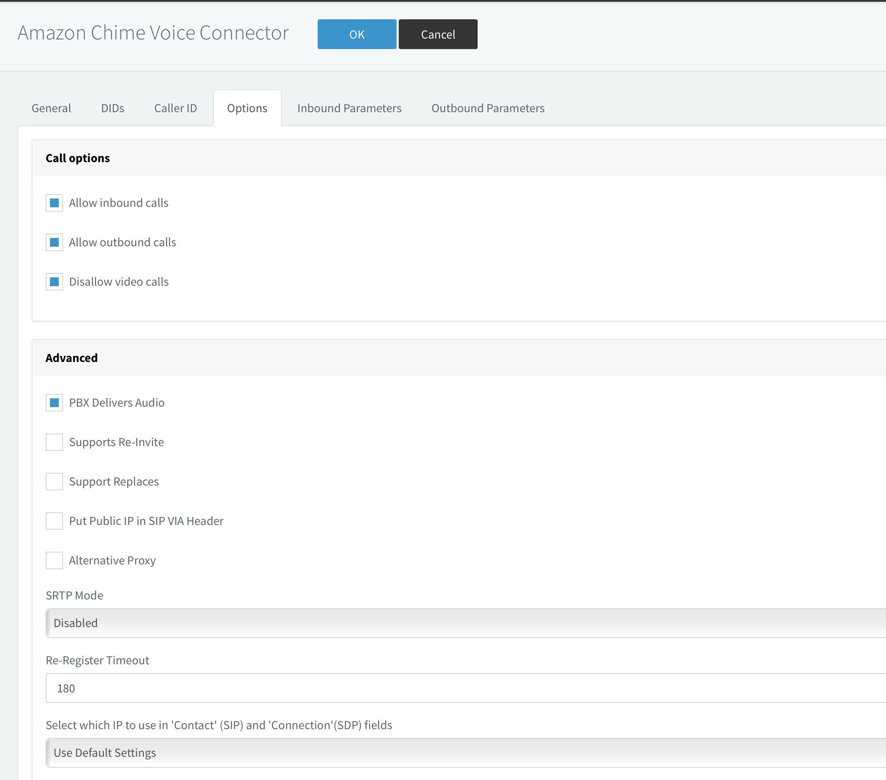
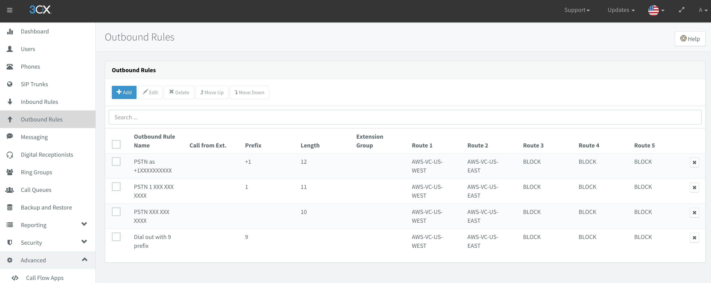
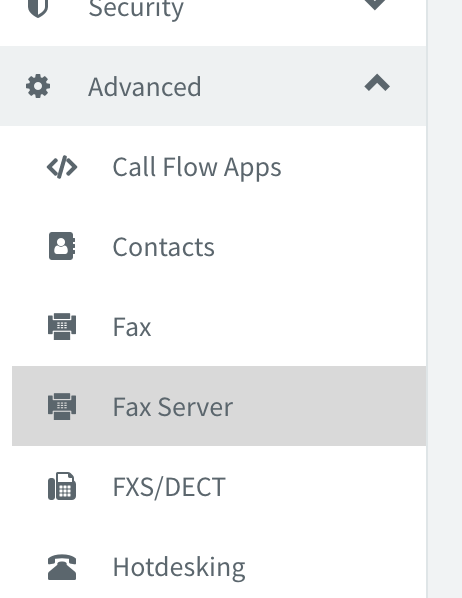

## Table of contents
{: .no_toc .text-delta }

1. TOC
{:toc}

# 3CX and AWS Chaim integration
## Configuration AWS SIP Connector on 3CX

### Buy new PSTN number
Go to Amazon Chaim console use URL: https://console.chime.aws.amazon.com/  
  
Go to Phone number management - Orders tab, press "Provision phone numbers" button  
  
On Provision phone numbers windows select "Business Calling" and press Next button  
  
Select phone number which you need and press "Provision" button  

Switch to the "Invetory" tab and you can see your selected phone number

For set calling name, select PSTN number and press Actions -> Update default calling name, set name and save. Information will be updated after 7 days.   

### Create Voice connector for 3CX
Go to Voice connectors and create new one  
  
Fill Voice connector name and select AWS region, Encryption mode switch to Disabled  
  
Open created connector and go to Termination tab for configure outbound calls, swith Termination status to enabled    

Allowed host list need to be add 3CX public IP  
  
In section Credentials (Recommended) need to be assigned login and password for SIP TRUNK    
  
  
Setup Calling plan, select countries where users can make outgoing calls and press save  
  
Go to Origination tab for configure inbound routes, switch Origination status to Enabled.  
In Inbound routes section press "New" button and fill fields:   
* Host: <3CX Public IP>, Port: 5060, Protocol: TCP, Priority: 1,  Weight:5 and press Save  
  
Next step need assign phone number to created voice connector. On "Phone numbers" tab press Assign from inventory button and select PSTN number witch you want assign.   

## Configuration AWS SIP Connector on 3CX
Open 3CX web ui admin panel and go to SIP Trunks, press "Add SIP Trunk" need select "Amazone Chime Voice Connector"  
   
Fill important fields:
> Name of Trunk;   
> Registat/Server/IP: <On AWS Chime console in voice connector Termination tab: Outbound host name>;  
> Type of Authentication: Do not require - IP Based;  
> Authentication ID: created username on AWS Chime voice connector;  
> Authentication Password: created password on AWS Chime voice connector;

> Main Trunk No: type PSTN phone number start from +1;  
> Set destination for calls during office hours;   
> Set destination for calls outside office hours;

   
On DIDs tab, add Single DID (your PSTN number)   

On Options tab:
> Transport protocol set: UDP  
> Move up codec G729

  
  

Press Ok button for save changes.

Go to Outbound Rules:  Press Add button for create new rule:
> Rule Name:   
> Calls to number starting: +1  
> Calls to Numbers with a length of: 12  
> Route 1: select Amazone Chime Voice Connector, Strip Digits: 0

  
  

# 3CX and AWS Chaim faxes 
## Inbound faxes 
For turn on fax server, go to 3CX WEB UI -> Advanced -> Fax Server  
  
  
Type Default Email Address for recive faxes, Enable G.711 to T.38 Fallback, for save press OK button     
  
  
Go to SIP Trunks, open AWS sip trunk, on DIDs tab add additional DID  
  

Go to Inbound Routes, Add new DID rule, type Name: Fax Rule, select DID for assign.  
Set Route calls to Send fax to -> <users who will recived fax to PDF>  
  

## Outbound fax 
For outboud faxes, need use ATA devices with fax machine.  
Or use software for SipToFax, like:  
http://www.t38faxvoip.com/  

## References 
https://www.3cx.com/docs/amazon-chime-voice-connector-sip-trunk/  
https://docs.aws.amazon.com/chime/latest/ag/network-config.html#bandwidth   
