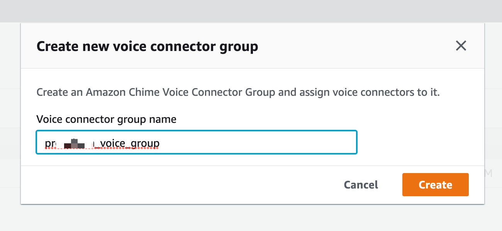
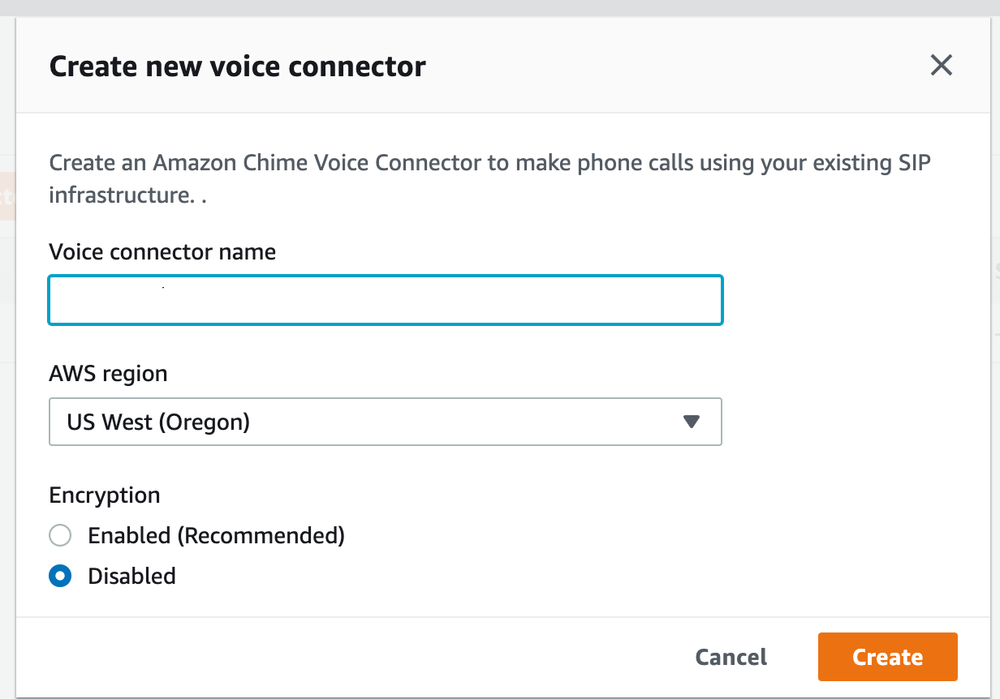

## Table of contents
{: .no_toc .text-delta }

1. TOC
{:toc}

# 3CX and AWS Chaim integration
## Configuration AWS SIP Connector on 3CX

### Buy new PSTN number
Go to Amazon Chaim console use URL: https://console.chime.aws.amazon.com/  
  
Go to Phone number management - Orders tab, press "Provision phone numbers" button  
  
On Provision phone numbers windows select "Business Calling" and press Next button  
  
Select phone number which you need and press "Provision" button  

Switch to the "Invetory" tab and you can see your selected phone number

For set calling name, select PSTN number and press Actions -> Update default calling name, set name and save. Information will be updated after 7 days.   

### Create Voice connector for 3CX
Create voice connector group   
    

Go to Voice connectors and create two one each on different region (US West, US East)  
  

  
Fill Voice connector name and select AWS region, Encryption mode switch to Disabled  
  
Open created connector and go to Termination tab for configure outbound calls, swith Termination status to enabled    

Allowed host list need to be add 3CX public IP  
  
In section Credentials (Recommended) need to be assigned login and password for SIP TRUNK    
  
  
Setup Calling plan, select countries where users can make outgoing calls and press save  
  
Go to Origination tab for configure inbound routes, switch Origination status to Enabled.  
In Inbound routes section press "New" button and fill fields:   
* Host: <3CX Public IP>, Port: 5060, Protocol: TCP, Priority: 1,  Weight:5 and press Save  
  
Next step need assign phone number to created voice connector. On "Phone numbers" tab press Assign from inventory button and select PSTN number witch you want assign.   

Now we have created two voice connectors with same settings on different regions  
  

Open Voice group and on general tab add two voice connectors. Set Voice trunk priority  
  
  

Go to Phone numbers and Assign Phone numbers to the Voice group   
  
     

## Configuration AWS SIP Connector on 3CX
Open 3CX web ui admin panel and go to SIP Trunks, press "Add SIP Trunk" need select "Amazone Chime Voice Connector"  
   
Fill important fields:
> Name of Trunk;   
> Registat/Server/IP: <On AWS Chime console in voice connector Termination tab: Outbound host name>;  
> Type of Authentication: Do not require - IP Based;  
> Authentication ID: created username on AWS Chime voice connector;  
> Authentication Password: created password on AWS Chime voice connector;

> Main Trunk No: type PSTN phone number start from +1;  
> Set destination for calls during office hours;   
> Set destination for calls outside office hours;

   
On DIDs tab, add Single DID (your PSTN number)   

On Options tab:
> Transport protocol set: UDP  
> Move up codec G729

  
  

Press Ok button for save changes.

Go to Outbound Rules:  Press Add button for create new rule:
> Rule Name:   
> Calls to number starting: +1  
> Calls to Numbers with a length of: 12  
> Route 1: select Amazone Chime Voice Connector, Strip Digits: 0

  
  

## Porting PSTN number to Amazone AWS Chime

You create a support request to port existing phone numbers into Amazon Chime.

### To port existing phone numbers into Amazon Chime

1. Do one of the following:  
> Open the Amazon Chime console at https://chime.aws.amazon.com/.
> Choose Support, Submit request.
> If you are an AWS Support customer, open the AWS Support Center page, sign in if necessary, and choose Create case. Choose Technical support. For Service, choose Chime.

2. For Category, choose Other.  
3. For Subject, enter Porting phone numbers in.  
4. For Issue or Description, enter the following:  
**For porting U.S. numbers:**
* Existing phone numbers to port in. Indicate the phone number type—Business Calling, Voice Connector, or SIP Media Application Dial-In.
* Billing Telephone Number (BTN) of the account.
* Authorizing person’s name. This is the person in charge of account billing with the current carrier.
* Current carrier, if known.
* Service account number, if this information is present with the current carrier.
* Service PIN, if available.
* Service address and customer name, as they appear in your current carrier contract.
* Requested date and time for the port.  
* (Optional) If you want to port your BTN, indicate one of the following options:  
    I am porting my BTN and I want to replace it with a new BTN that I am providing. I can confirm that this new BTN is on the same account with the current carrier.  
    I am porting my BTN and I want to close out my account with my current carrier.  
    I am porting my BTN because my account is currently set up so that each phone number is its own BTN. (Select this option only when your account with the current carrier is set up this way.)  
    Download the Letter of Agency (LOA) for Local Telephone Number Porting and fill it out. If you are porting phone numbers from different carriers, fill out a separate LOA for each carrier.  
**For porting international numbers:**
* You must use the SIP Media Application Dial-In product type for non-US phone numbers.
* Type of number (Local or Toll-Free)
* Existing phone numbers to port in.
* Estimate usage volume
* Country
* You need to fill out the Letter Of Agency document provided by AWS Support.
* See Country requirements for phone numbers for information about the documents required for porting in countries that support porting.
5. Do one of the following:
* If you are submitting a support request from the Amazon Chime console, for Email, enter the email address associated with your Amazon Chime administrator account. Choose Submit request.
* If you are creating a case in AWS Support Center, for Attachments, choose Choose files, and attach the required documents. For Contact options, select a contact method. Optionally, for Additional contacts, enter email addresses of people to be notified of case status updates.
AWS Support lets you know whether your phone numbers can be ported from your existing phone carrier. You receive responses from AWS Support in one of the following ways:  
* If you submitted a support request from the Amazon Chime console, AWS Support emails the Operations contact specified under Alternate Contacts in the Contact Information for your AWS account. For more information, see Editing contact information in the AWS Billing and Cost Management User Guide.
* If you created a case in AWS Support Center, you receive responses based on your selected contact methods and any email addresses you entered for additional contacts.
6. If your phone numbers can be ported, one of the following happens:
* If you submitted a support request from the Amazon Chime console, AWS Support asks you to provide your completed Letter of Agency (LOA). If you are porting phone numbers from different carriers, fill out a separate LOA for each carrier. This authorizes your existing phone carrier to release your existing phone numbers for porting.
* If you created a case in AWS Support Center and attached your completed LOA, AWS Support proceeds to step 8.
7. After you provide the LOA, AWS Support confirms with your existing phone carrier that the information on the LOA is correct. If the information provided on the LOA does not match the information that your phone carrier has on file, AWS Support contacts you to update the information provided on the LOA.
8. (Optional) View the status of your porting request in the Amazon Chime console under Calling, Phone number management, Pending. AWS Support also contacts you with updates and requests for further information, as needed. For more information, see Phone number porting status definitions.
9. Assign the ported phone numbers.
* Assign Amazon Chime Business Calling phone numbers to invidual users.
* Assign Amazon Chime Voice Connector numbers to your Voice Connectors.
* For Amazon Chime SIP Media Application Dial-In numbers, use SIP rules to assign numbers. For more information about SIP rules, refer to Creating SIP rules.
The phone numbers are not activated for use until after the Firm Order Commit (FOC) date is established, as shown in the following steps. For more information, see Managing phone number inventory and Creating an Amazon Chime Voice Connector.
10. After your existing phone carrier confirms that the LOA is correct, they review and approve the requested port. Then they provide AWS Support with a Firm Order Commit (FOC) date and time for the port to occur.
11. AWS Support contacts you with the FOC to confirm that the date and time works for you.
>Note
The phone numbers cannot place or receive calls until you assign them.
12. On the FOC date, the ported phone numbers are activated for use with Amazon Chime.

Reference: https://docs.aws.amazon.com/chime/latest/ag/porting.html 

### AWS settings 
Go to AWS Chime console Phone number management, select porting number and press Assign   
  
Select Voice connector group and press Next button    
  
Select voice group and press Assign.
  

### 3CX settings 
Open 3CX Web UI and go to SIP Trunk menu. For each AWS sip trunk need add DID PSTN numbers. Open SIP Trunk and switch to DID tab.   
Press Add single DID and enter PSTN number start +1  
   
Go to Inbound routes and press add new one for new DID. Assign distanation to digital receptionist, extension or other.  
  
On outbound routes need create rules for outbound calls use callerID with new PSTN number.  
  
For each route setup callerID like:  
  

## References 
https://www.3cx.com/docs/amazon-chime-voice-connector-sip-trunk/  
https://docs.aws.amazon.com/chime/latest/ag/network-config.html#bandwidth   

  

