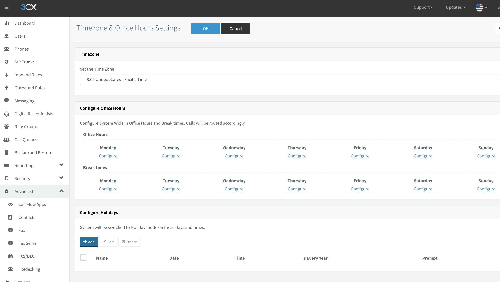
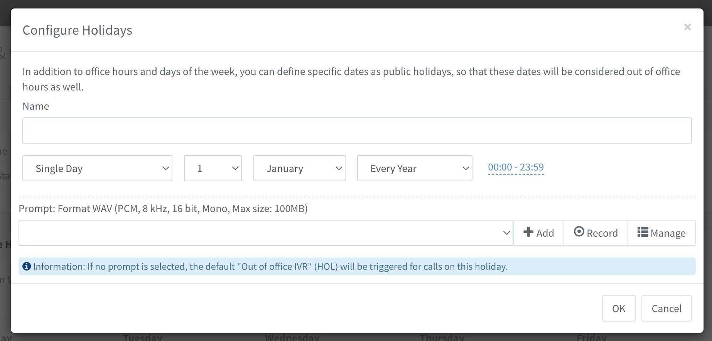

# Time Based Scheduling
For setup work office hours, go to 3CX Web UI -> Advanced -> Timezone & Office Hours Settings   
- Set Timezone when you located   
- Set Office Hours for each day of weeks  
- Set Break Times for each day of weeks
  

  
## Configure Holidays 
Press add button for create a new one rule. Type name, single day or range of days.  
Select Every Year if you want repeat that rule every time.   
Upload or record wav file with notification and press OK for save rule.   

# 3CX Time Based Scheduling
<!-- blank line -->
<figure class="video_container">
    <iframe width="900" height="600" src="https://www.youtube.com/embed/gtmbz4yYxvc" title="YouTube video player" frameborder="0" allow="accelerometer; autoplay; clipboard-write; encrypted-media; gyroscope; picture-in-picture" allowfullscreen></iframe>
</figure>
<!-- blank line -->

