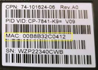
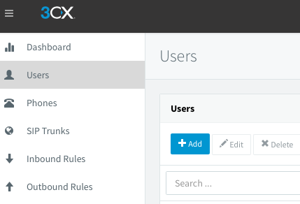
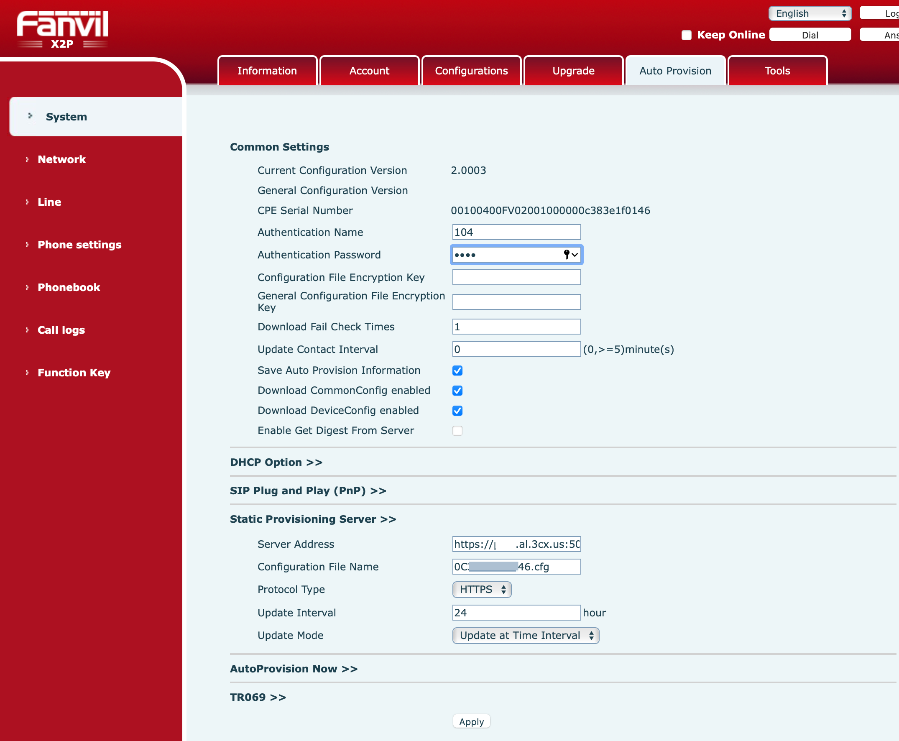

## Table of contents
{: .no_toc .text-delta }

1. TOC 
{:toc}
   
## Collect data about VoIP phones
Create Excel file with next column, Example:  

| Vendor       | Model    |      MAC     | 3CX Extension | FirstName | LastName |
|:-------------|:---------|:-------------|:--------------|:----------|:---------|
| FANVIL       | Х7       | 00B8B32C0412 | 104           | Maksim    | Dogonov  |

MAC IP Phones you can get it white label on back side. 



## Add extension он 3CX: 
Open 3CX console: https://<<domain name or ip>>:5001/#/loading  
User -> Add  

  
  
Fill FirstName, LastName from Excel file  
  
**GoTo Voicemail:** and copy PIN number to Excel file
  
**GoTo Options:** uncheck -  Disallow use of extension outside the LAN (Remote extensions using Direct SIP or STUN will be blocked)  
  
**Goto Phone Provisioning:**  
Press Add -> Choose from available models select IP Phone model  
Type Mac Address and press «Ok» button.  
  
**In IP Phone section:** Set Provisioning Method: Direct SIP (STUN - remote)  
  
**In Codecs:** Make UP G729 codec  

For save all changes on top page press «Ok» button    

## Configure autoprovision on IP Phones 
  
**Turn on IP Phone and connect to the LAN, when boot is complete:**  
```Menu -> Status, take IP  ```  

Open WEB UI phones http://<ip adress>
Goto to Auto provision tab 

**Update firmware:**  
**download 3CX firmware from:** https://www.3cx.com/support/phone-firmwares/  
**And make update:** https://www.3cx.com/sip-phones/firmware-update-fanvil/  
  
**Authentication name:** <ext num (example: 104)>  
**Authentication password:** <voicemail pin>  
  
Server address will be point to URL  on 3CX   

  

After reboot, phone will be take ext.  

## Some testing  
Dial from phone to local ext  
Dial from phone to outside office  
Dial from any phones to ip phone  