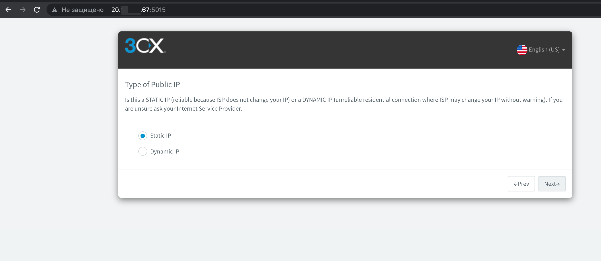
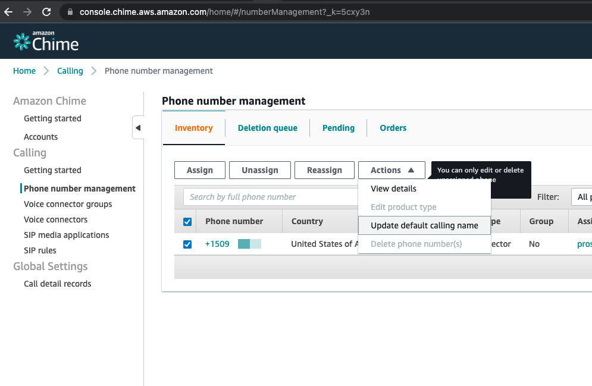
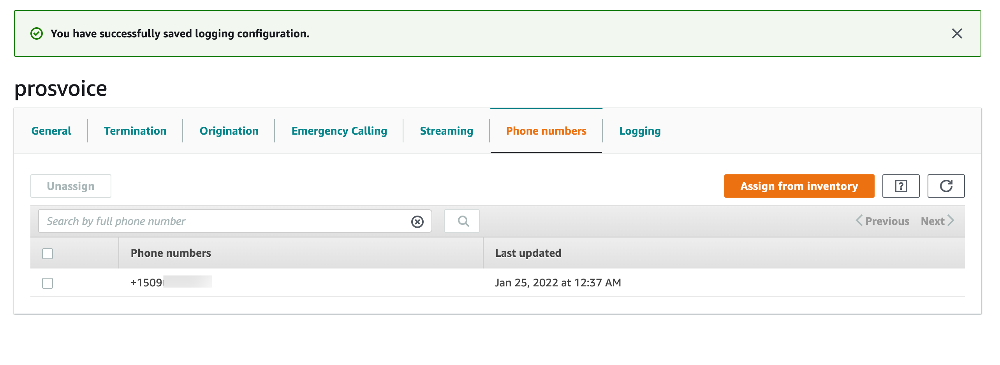
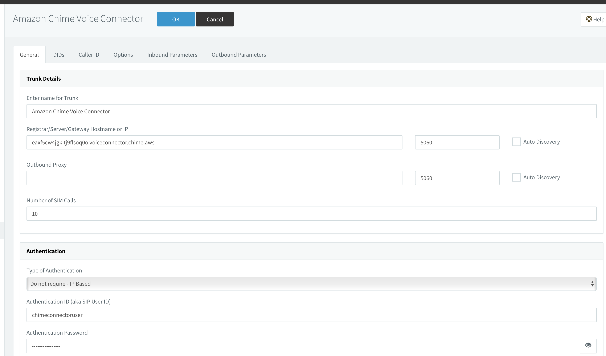
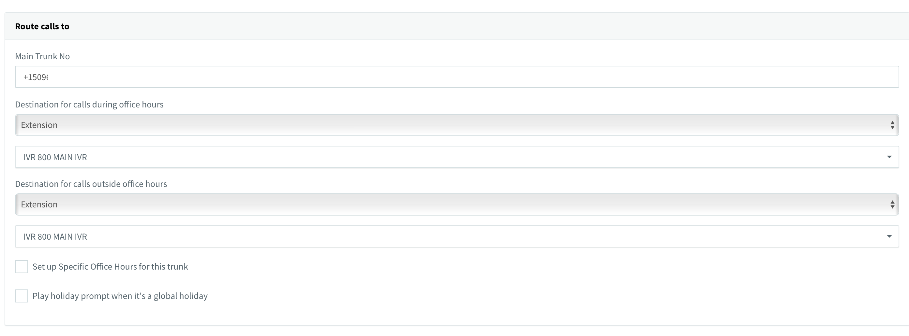
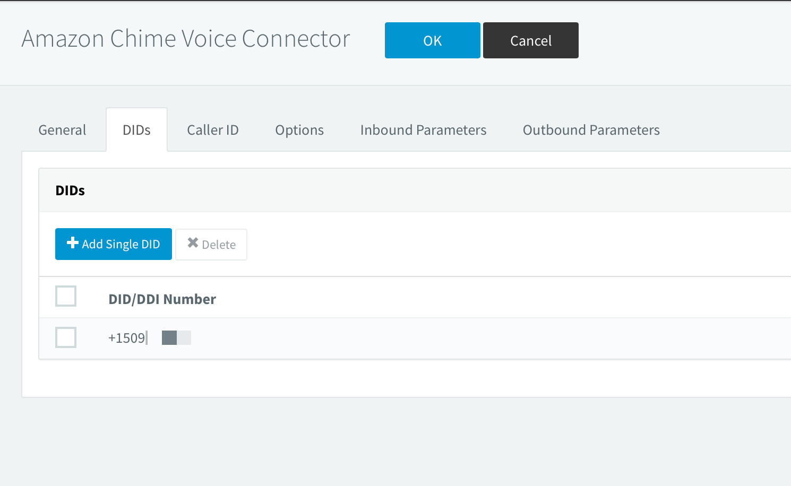
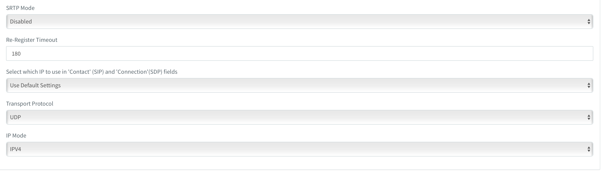

## Table of contents
{: .no_toc .text-delta }

1. TOC 
{:toc}
# 3CX Deploy on Azure

## Create VM 3CX Phone System on Microsoft Azure Portal  
Open portal.azure.com, in search box type 3CX and create 3CX Phone System.  
You will forward to wizard Create VM.
  

  
When VM is created, you need take public IP adress and open URL on browser on your PC like:   
http://<public IP VM>:5015
You will see open wizard page 3CX.  
  

On 3CX customer portal take subscription number for registration new instance and paste to the http://<public IP VM>:5015 and press Next   

  
  
Type Username and Password for manage new instances   
  

  
Confirm public IP address  
  

  
Select Static or Public type IP address on instance  
  

  
Type FQDN or select No option for 3CX will generate custom FQDN for your instances  
  

  
Type admin email address for get some notification   
  

  
Set up Country and timezone for instance   
  

  
Internal Extension type, and setup first extension  
  

  
Select Coutries that calls can be made to  
  

  
Select Language interface  

  
SetUP is Done, you can login to web instance page   

For registration instance on customer portal 3CX, you will go to instance web page -> Settings -> Instance Manager  

  
Select all checkboxes for provide access to custommer portal 3CX for manage them  
  

  
Now you can see instance on customer portal 3CX, done. 
  

## Open ports on Firewall VM 3CX Phone System 

For Azure need add 2 rules for open RTP trafic:  
1. UDP 9000-10999  
2. UDP 7000-8999  
  
Table with description 3CX ports  
PROTOCOL | PORT (DEFAULT) | DESCRIPTION | PORT FORWARDING REQUIRED
TCP | 5001 or 443 | HTTPs port of Web Server. This port can be configured | Yes – if you intend on using a 3CX client, Bridge Presence, Remote IP Phones from outside your LAN and 3CX WebMeeting functionality
TCP | 5015 | This port is used for the online Web-Based installer wizard (NOT 3CX config command line tool) only during the installation process | Optional - During the installation process when the Web-Based installer is used from external source
UDP & TCP | 5060 | 3CX Phone System (SIP) | Yes – if you intend on using VoIP Providers and Remote Extensions that are NOT using the 3CX Tunnel Protocol / 3CX SBC
TCP | 5061 | 3CX Phone System (SecureSIP) TLS | Yes – if you intend on using Secure SIP remote extensions
UDP & TCP | 5090 | 3CX Tunnel Protocol Service Listener | Yes -if you intend on using remote extensions using the 3CX Tunnel Protocol (within the 3CX clients for Windows / Android / iOS) or when using the 3CX Session Border Controller
UDP | 9000-10999 7000-8999 | 3CX Media Server (RTP) – WAN audio/video/t38 streams  3CX Media Server (RTP) – LAN audio/video/t38 streams | Yes – if you intend on using remote extensions, WebRTC or a VoIP Provider  No - If you have strict routing on your LAN though, you must allow traffic from/to your 3CX server on there ports (Also applies to site-to-site VPNs)
TCP | 2528 | 3CX SMTP Server - Must allow PBX passthrough on the network for the PBX to send email notifications via the 3CX SMTP | No

Reference:  
  
https://www.3cx.com/docs/ports/  

# 3CX and AWS Chaim integration 
## Configuration AWS SIP Connector on 3CX

### Buy new PSTN number
Go to Amazon Chaim console use URL: https://console.chime.aws.amazon.com/  
  
Go to Phone number management - Orders tab, press "Provision phone numbers" button  
  
On Provision phone numbers windows select "Business Calling" and press Next button  
  
Select phone number which you need and press "Provision" button  

Switch to the "Invetory" tab and you can see your selected phone number  

For set calling name, select PSTN number and press Actions -> Update default calling name, set name and save. Information will be updated after 7 days.   

### Create Voice connector for 3CX  
Go to Voice connectors and create new one  
  
Fill Voice connector name and select AWS region, Encryption mode switch to Disabled  
  
Open created connector and go to Termination tab for configure outbound calls, swith Termination status to enabled    

Allowed host list need to be add 3CX public IP  
  
In section Credentials (Recommended) need to be assigned login and password for SIP TRUNK    
  
  
Setup Calling plan, select countries where users can make outgoing calls and press save  
  
Go to Origination tab for configure inbound routes, switch Origination status to Enabled.  
In Inbound routes section press "New" button and fill fields:   
    * Host: <3CX Public IP>, Port: 5060, Protocol: TCP, Priority: 1,  Weight:5 and press Save  
  
Next step need assign phone number to created voice connector. On "Phone numbers" tab press Assign from inventory button and select PSTN number witch you want assign.   

## Configuration AWS SIP Connector on 3CX  
Open 3CX web ui admin panel and go to SIP Trunks, press "Add SIP Trunk" need select "Amazone Chime Voice Connector"  
   
Fill important fields:  
> Name of Trunk;   
> Registat/Server/IP: <On AWS Chime console in voice connector Termination tab: Outbound host name>;  
> Type of Authentication: Do not require - IP Based;  
> Authentication ID: created username on AWS Chime voice connector;  
> Authentication Password: created password on AWS Chime voice connector;  

  
> Main Trunk No: type PSTN phone number start from +1;  
> Set destination for calls during office hours;   
> Set destination for calls outside office hours;  
  
   
On DIDs tab, add Single DID (your PSTN number)   

On Options tab:   
> Transport protocol set: UDP  
> Move up codec G729  
  
  
  

Press Ok button for save changes.  
  
Go to Outbound Rules:  Press Add button for create new rule:
> Rule Name:   
> Calls to number starting: +1  
> Calls to Numbers with a length of: 12  
> Route 1: select Amazone Chime Voice Connector, Strip Digits: 0  
  

