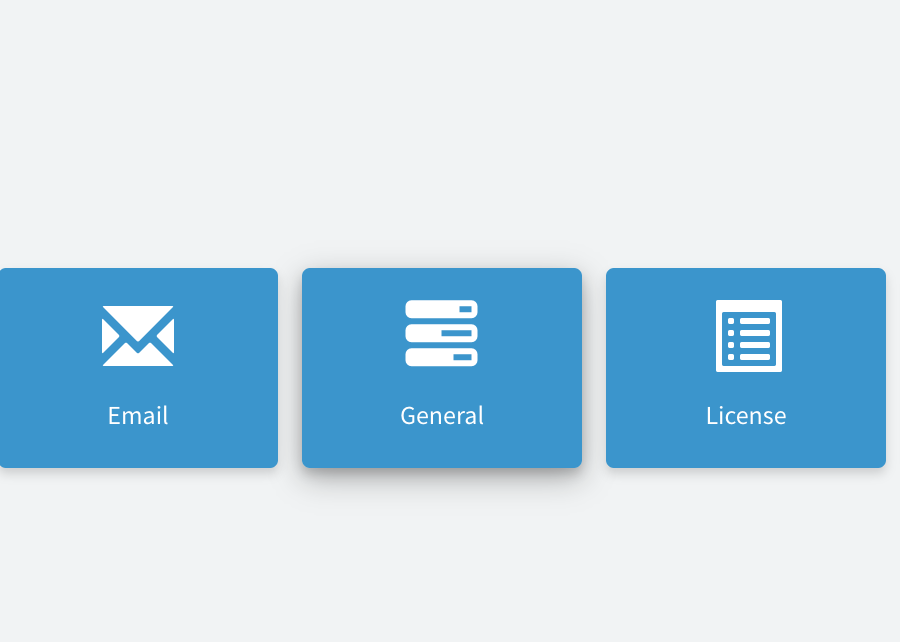
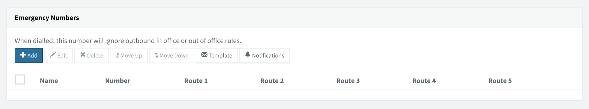
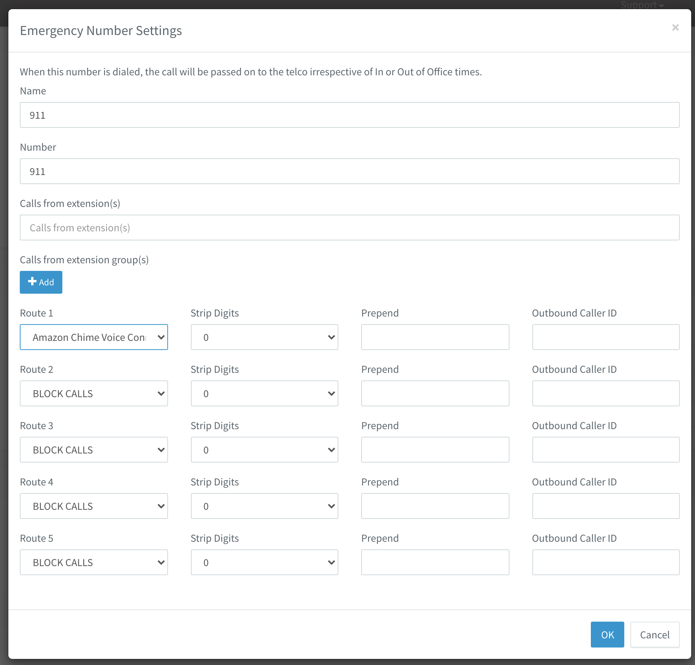

## Table of contents
{: .no_toc .text-delta }

1. TOC
{:toc}

# 3CX and AWS Chaim integration
For setup Emergency calls, on Web UI goto Settings -> General  
  

On Emergency Members sections press add  

Type Name: 911, Number (Emergency number): 911, and select Route 1 / Sip Trunk: 

 For save information press "OK" button.  

