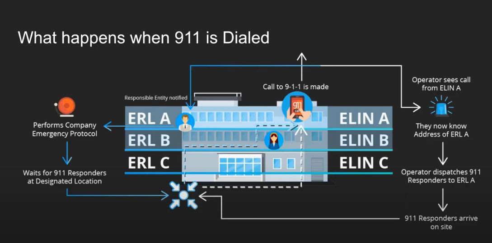

## Table of contents
{: .no_toc .text-delta }

1. TOC
{:toc}

# 3CX and AWS Chaim integration
Summary check list  

What happens when 911 is dialed  

For setup Emergency calls, on Web UI goto Settings -> General  
  

On Emergency Members sections press add  

Type Name: 911, Number (Emergency number): 911, and select Route 1 / Sip Trunk: 

 For save information press "OK" button.  

# The new e911 Regulation and how it works
In this video we explain what the e911 regulation is and how is works within 3CX.  

<!-- blank line -->
<figure class="video_container">
 <iframe width="900" height="600" src="https://www.youtube.com/embed/9lyo6HM7ocg" title="YouTube video player" frameborder="0" allow="accelerometer; autoplay; clipboard-write; encrypted-media; gyroscope; picture-in-picture" allowfullscreen></iframe>
</figure>
<!-- blank line -->

# Video how to setup emergency call on 3CX
https://www.youtube.com/watch?v=9lyo6HM7ocg&t=8s

