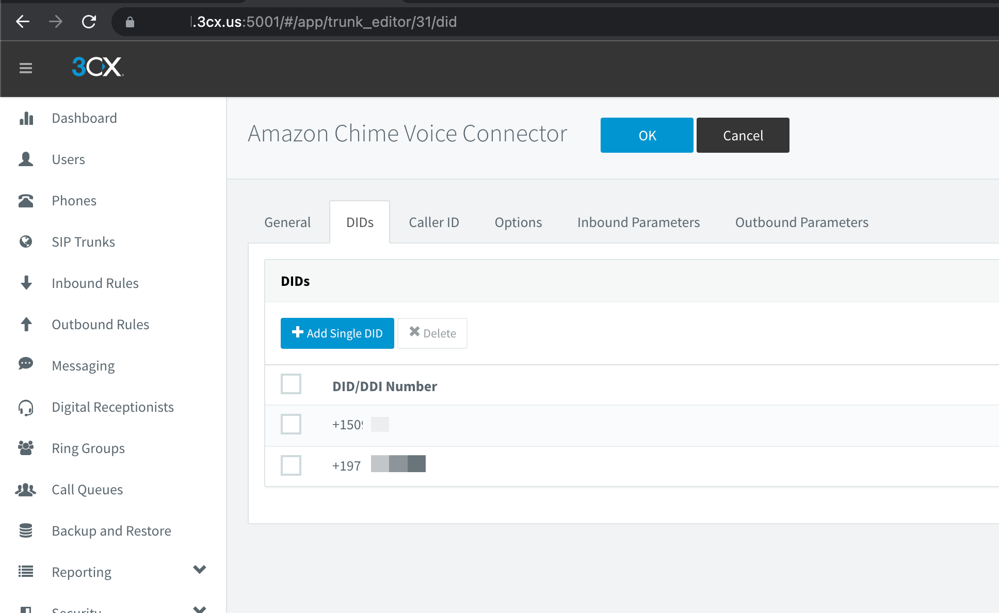

## Table of contents
{: .no_toc .text-delta }

1. TOC
{:toc}
   
# 3CX Configure faxes  
## Inbound faxes
For turn on fax server, go to 3CX WEB UI -> Advanced -> Fax Server  

Type Default Email Address for recive faxes, Enable G.711 to T.38 Fallback, for save press OK button     

Go to SIP Trunks, open AWS sip trunk, on DIDs tab add additional DID  

Go to Inbound Routes, Add new DID rule, type Name: Fax Rule, select DID for assign.  
Set Route calls to Send fax to -> users who will recived fax to PDF    

  

## Outbound fax
For outboud faxes, need use ATA devices with fax machine.  
Or use software for SipToFax, like:  
http://www.t38faxvoip.com/  