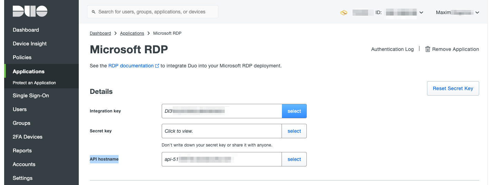

# DUO MFA for RDP or AVD (WVD)
If we want use DUO MFA on AVD (WVD), we must install DUO agent on all Windows 10 VMs for support authorisation DUO MFA.   

## Protect RDP on DUO
1. Go to Application and press Protect an Application   
2. On search fields type RDP and chose "Microsoft RDP" and press Protect 
3. Save Integration key, Secret key, API hostname for installation DUO agent on VM and press SAVE button.  

## Install DUO agent on Windows 10 multisession VM  
1. Connect to the Windows VM from Terminal Server use RDP client;   
2. On Windows 10 VM need download DUO agent use link: https://dl.duosecurity.com/duo-win-login-latest.exe   
3. Run the installer:  
a) Run the Duo Authentication for Windows Logon installer with administrative privileges (be certain that you are not installing version 4.1.0 if the target system is a domain controller).  
   If you receive an "Installation stopped" error from the Duo installer please refer to Duo KB article 6462 for remediation steps.  
c) When prompted, enter your API Hostname from the Duo Admin Panel and click Next. The installer verifies that your Windows system has connectivity to the Duo service before proceeding.  
   
d) Enter your integration key and secret key from the Duo Admin Panel and click Next again.  
    
    
    

When you try reconnect to VM again, you will see:   

also need enroll users in DUO MFA.  

---
### REFERENCES
[DUO DOCS MFA RDP](https://duo.com/docs/rdp)

