# DUO protect Microsoft Azure Active Directory
see https://duo.com/docs/azure-ca 

Login https://duosecurity.com 
and go to Application - Protect an Application   
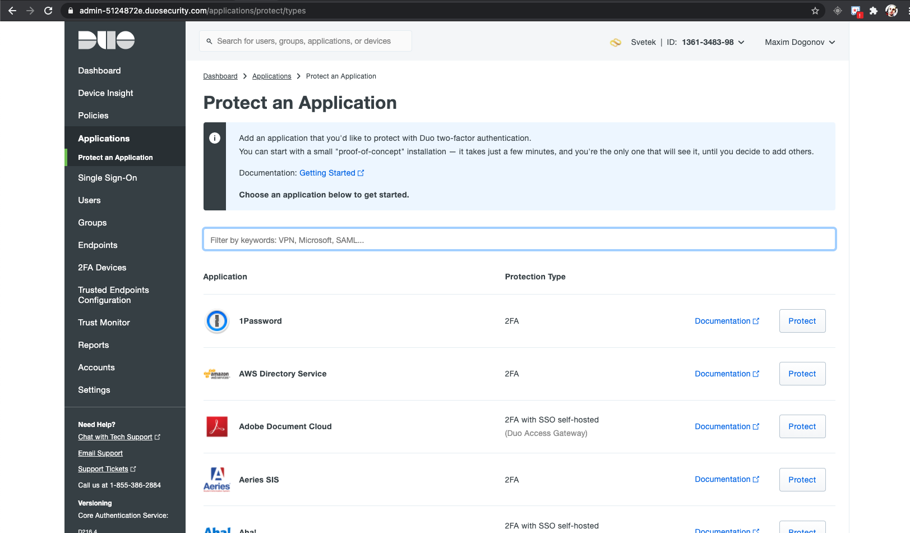  

In search field type Azure Active Directory.  
And press Protect button on Microsoft Azure Active Directory line.   
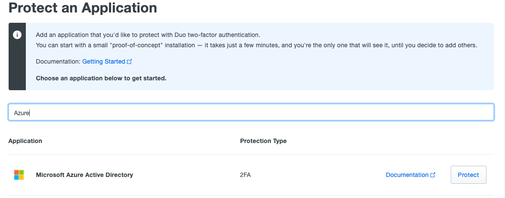  

Next step press Autorize button  
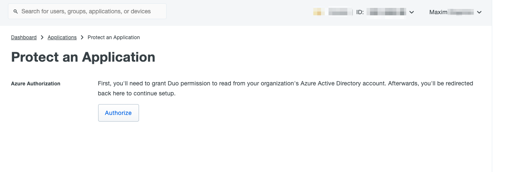  
  
Next step need type Azure AD Admin auth credentials  
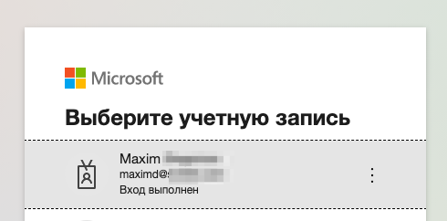  

Press Accept on this step  
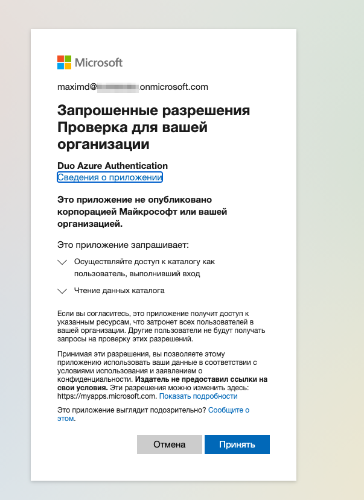  

That step can be if you try auth not Azure Administrator  
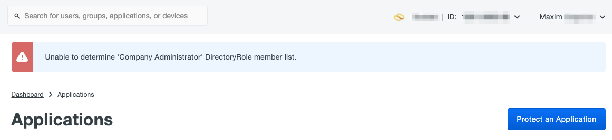  

Use MFA if that enabled on your configuration  
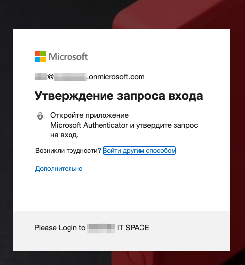  

On this step need copy JSON on "Custom control" and press "Save" on the end page
  
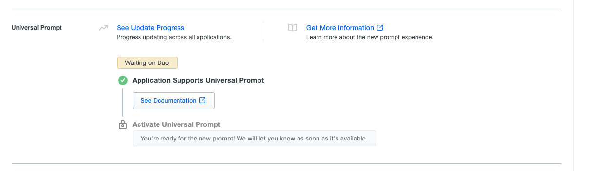  
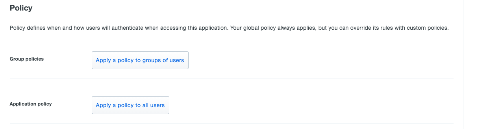  
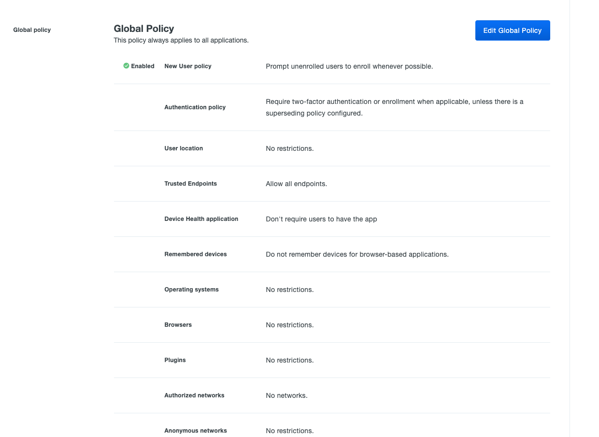  
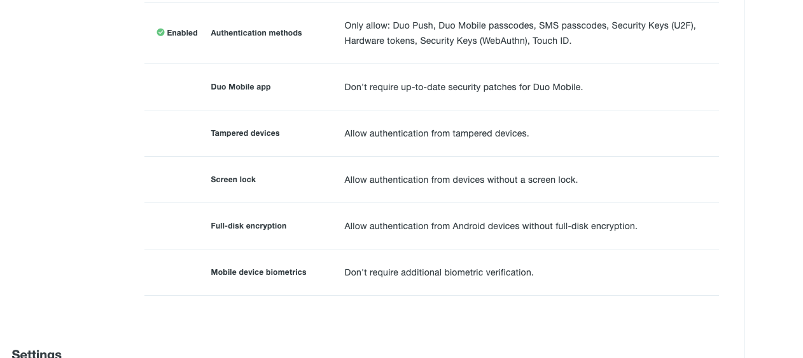  
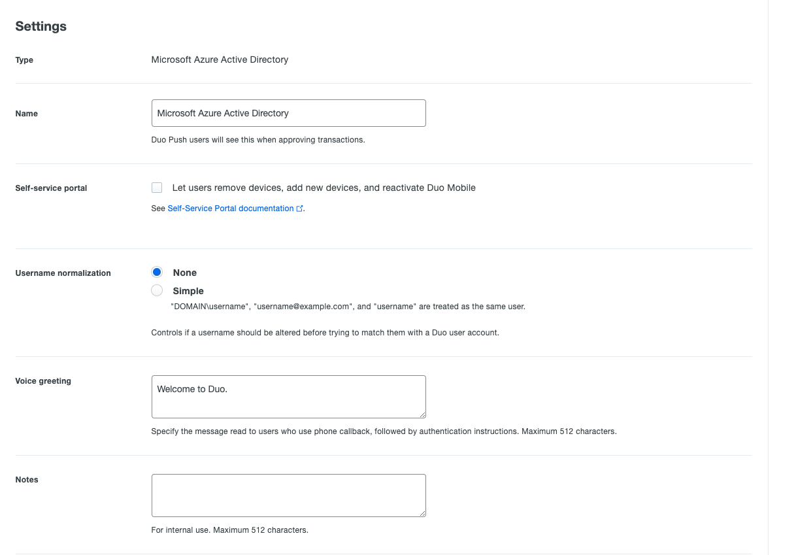  
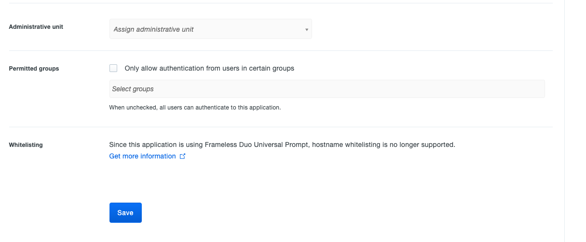  
  
Go to portal Azure AD, click on "Security" menu  
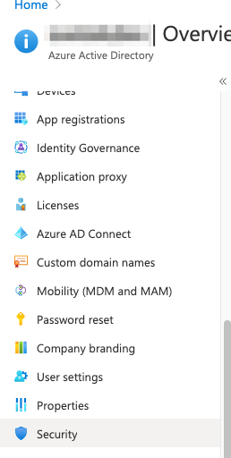   
  
Go to "Conditional Access"  
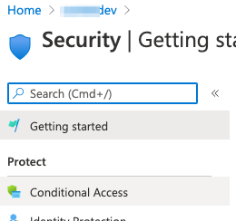  

Go to Custom control (Preview)  
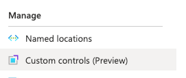  

Create New custom control     
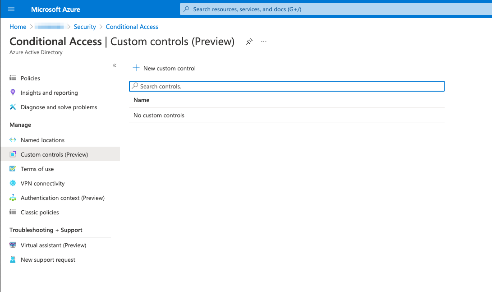  
 
Give name "RequiredDuuoMfa", paste JSON when we copy from DUO page. and press "Save"   
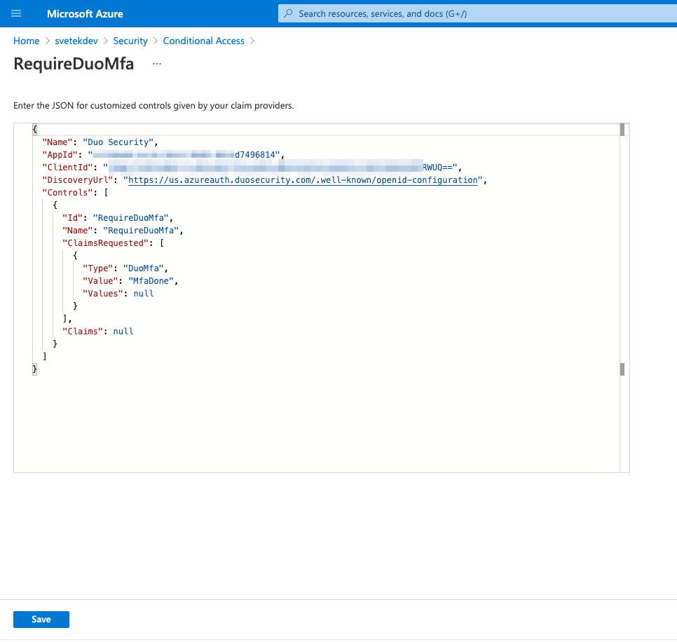  

Go to Azure AD, security, Conditional Access, Policies and press "New policy"  
  

Type name Require Duo MFA, but first need create security group with name "DUO Users"  
In Cloud apps or actions need select All cloud apps or Specified cloud apps for DOU MFA AUTH
In Grant select "Grant access" and enable checkbox "RequireDuoMfa"   
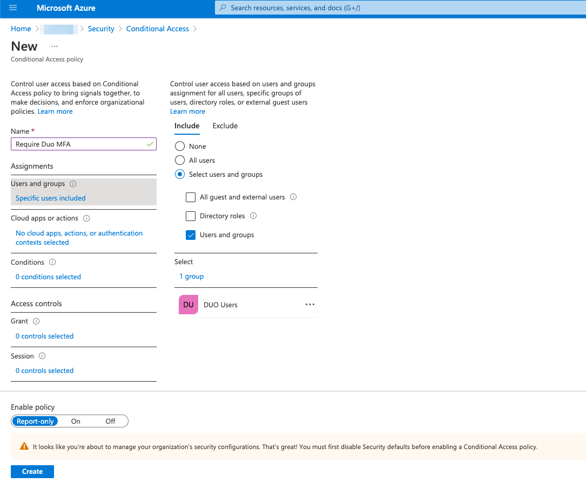  
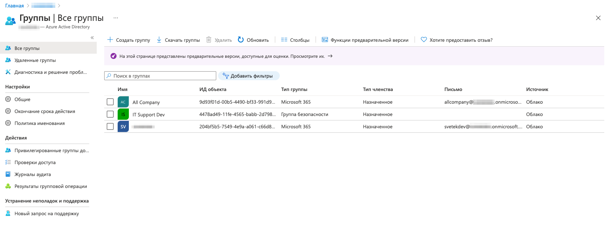  
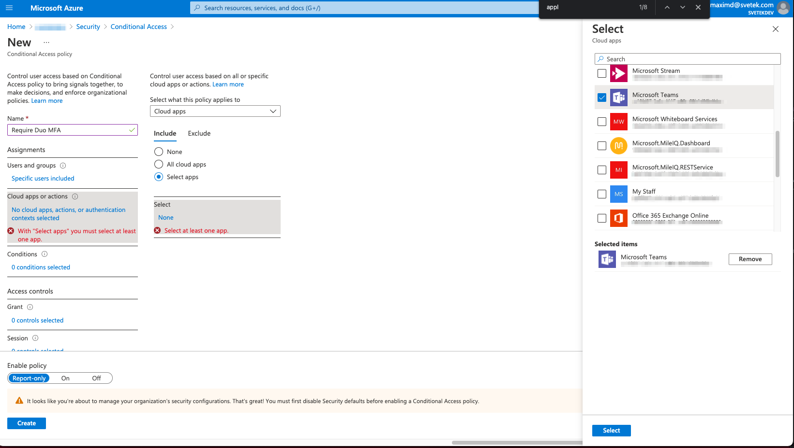  

Enable policy set "ON", if you get error with setup to on. 
Need go to Azure AD - Properties - Manage Security defaults and 
Enable Security defaults switch to "No"  
to be continued ....!!!