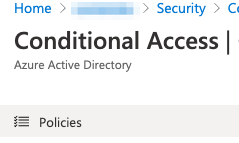

# DUO protect application Microsoft Azure Active Directory
see https://duo.com/docs/azure-ca 

Login https://duosecurity.com 
and go to Application - Protect an Application   
  

In search field type Azure Active Directory.  
And press Protect button on Microsoft Azure Active Directory line.   
  

Next step press Autorize button  
  
  
Next step need type Azure AD Admin auth credentials  
  
  
  
  
  
  
  
  
  
  
  
  
  
  
  
   
  
  
  
  
  
  

to be continued ....!!!