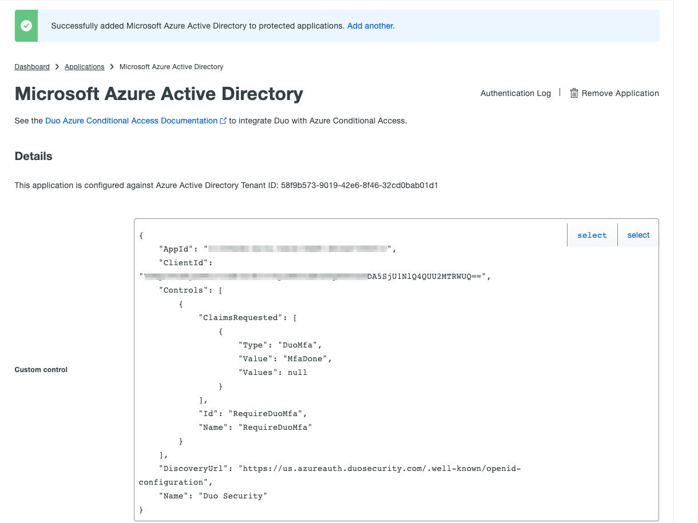

# DUO protect application Microsoft Azure Active Directory
see https://duo.com/docs/azure-ca 

Login https://duosecurity.com 
and go to Application - Protect an Application  
{:height="600px" width="400px"}  

In search field type Azure Active Directory.
And press Protect button on Microsoft Azure Active Directory line. 
{:height="600px" width="400px"}  

Next step press Autorize button 
{:height="600px" width="400px"}  

Next step need type Azure AD Admin auth credentials
{:height="600px" width="400px"}  

{:height="600px" width="400px"}  
{:height="600px" width="400px"}  
{:height="600px" width="400px"}  
{:height="600px" width="400px"}  
{:height="600px" width="400px"}  
{:height="600px" width="400px"}  
{:height="600px" width="400px"}  
{:height="600px" width="400px"}  
{:height="600px" width="400px"}  
{:height="600px" width="400px"}  
{:height="600px" width="400px"}  
{:height="600px" width="400px"}  
{:height="600px" width="400px"}  
{:height="600px" width="400px"}  
{:height="600px" width="400px"}  
{:height="600px" width="400px"}  
{:height="600px" width="400px"}  
{:height="600px" width="400px"}  
{:height="600px" width="400px"}  
{:height="600px" width="400px"}  

to be continued ....!!!