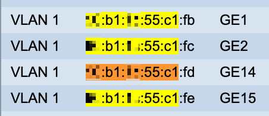

## Table of contents
{: .no_toc .text-delta }

1. TOC 
{:toc}
   
### Setting on managed switch 
Open Switch Web interface and assign taged VLAN 2 on each port connected to the HYPER-V server.  
On our example environment we have 4x 1Gb ports in New Team Trunk. 
You can find all server ports on switch use mac address:   


### SetUP HYPER-V TAG VLAN 2


Open OpenSwitch settings, and double check settings:


Open VM settings and double check settings:


For allow tagged vlans in to the VM we need switch VM network interface to trunk mode use powershell script:  

```
Set-VMNetworkAdapterVlan -VMName <VM name> -Trunk -AllowedVlanIdList 0-100 -NativeVlanId 0
```

When script done success, we can check use command "Get-VMNetworkAdapterVlan", output example:

  

### Setup tagged interface on UBUNTU VM network  
Logged in 
edit /etc/netplan/00-installer-config.yaml, add VLAN section like on example bellow:  
```
# This is the network config written by 'subiquity'
network:
  ethernets:
    eth0:
      dhcp4: true
  vlans:
    vlan2:
      id: 2
      link: eth0
      addresses: [10.2.10.251/23]
      dhcp4: false
  version: 2
```
for applying settings:   
```
netplan apply  
```

for check settings, run command: ifconfig  
```
vlan2: flags=4163<UP,BROADCAST,RUNNING,MULTICAST>  mtu 1500
        inet 10.2.10.251  netmask 255.255.254.0  broadcast 10.2.11.255
        inet6 fe80::215:5dff:fe0a:d0c  prefixlen 64  scopeid 0x20<link>
        ether 00:15:5d:0a:0d:0c  txqueuelen 1000  (Ethernet)
        RX packets 203984  bytes 17621645 (17.6 MB)
        RX errors 0  dropped 0  overruns 0  frame 0
        TX packets 14160409  bytes 595569163 (595.5 MB)
        TX errors 0  dropped 0 overruns 0  carrier 0  collisions 0
```