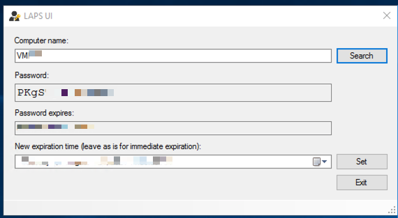
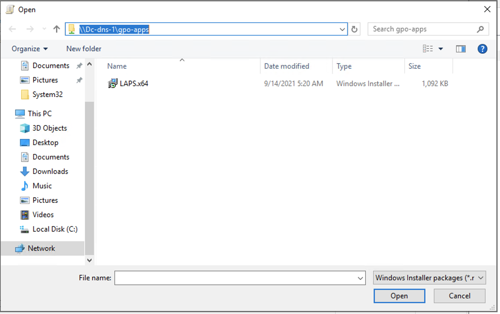
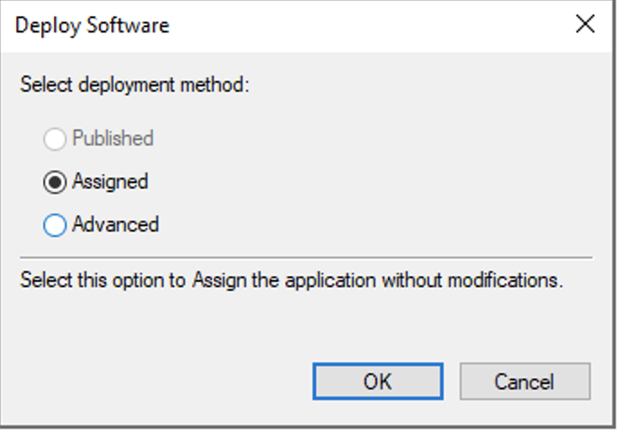

## Table of contents
{: .no_toc .text-delta }

1. TOC 
{:toc}
# Microsoft LAPS (Local Administrator Password Security)

## Download and Install LAPS on Active Directory

Download [LAPS](https://www.microsoft.com/en-us/download/details.aspx?id=46899)    
  
Install LAPS on Domain Controler:
  
  
  
Create two security group, one for readers (LAPS-readers) and one for writers (LAPS-reset):  
  

Copy path organisation unit  


Run powershell script (Replace organisation unit path):  
```
Import-module AdmPwd.PS
Update-AdmPwdADSchema

Set-AdmPwdComputerSelfPermission -OrgUnit "CN=Computers,DC=churchoregon,DC=local"
Set-AdmPwdReadPasswordPermission -OrgUnit "CN=Computers,DC=churchoregon,DC=local" -Allowedprincipals "LAPS-readers"

Set-AdmPwdReadPasswordPermission -OrgUnit "CN=Computers,DC=churchoregon,DC=local" -Allowedprincipals "LAPS-reset"
Set-AdmPwdResetPasswordPermission -OrgUnit "CN=Computers,DC=churchoregon,DC=local" -Allowedprincipals "LAPS-reset" 
```  
Open Group Policy Managment:  
  
  
Create new GPO container with LAPS-PWD:    
   
  
  
Edit new GRO LAPS  
  
  
  
Open Computer Configuration -> Polices -> Administrative Template -> LAPS    
  
  
Edit "Password Settings" switch to Enabled  
  
  
Edit "Enable local admin password managment" switch to Enabled   
  
 
## Install LAPS on PC 
  
Need install LAPS on PC, or setup installation use GPO

## How to read password and make reset  
  
Run LAPS UI on DC. Enter Computer name and press "Search".
  
    

## How to install LAPS on all PC in domain  
### Create share for apps
Open Server Manager / File and Storage Services -> Shares  
Task -> New Share for create  
  

Select SMB Share - Quick and press Next   
  

Type name GPO-APPS ad press Next  
  

Press Next  
  

Press Next  
  

### Setup LAPS package use GPO on all Computer in domain  
Open GPO LAPS and go to Computer -> Polices -> Software Settings -> Software Installation, right mouse click select New -> Package  
  
Select network patch apps like on screenshot    
  
Select "Assigned" mode and press OK  
  

run gpupdate command in powershell console on DC  

### Check ExtendedRights permissions on OU
To get information on the groups and users able to read the password (ms-MCS-AdmPwd) for a specific Organizational Unit (OU), run the following command.  
```
Find-AdmPwdExtendedRights -identity "CN=Computers,DC=vixon,DC=local" | Format-Table ExtendedRightHolders
```

### Set all passwords
```
Get-ADComputer -Filter * -SearchBase “CN=Computers,DC=vixon,DC=local” | Reset-AdmPwdPassword -ComputerName {$_.Name}
```
### List all passwords 
```
Get-ADComputer -Filter * -SearchBase "CN=Computers,DC=vixon,DC=local" | Get-AdmPwdPassword -ComputerName {$_.Name}
```

## REFERENCES
[INSTALLATION LAPS](https://www.veeam.com/blog/microsoft-laps-deployment-configuration-troubleshoot-guide.html)
