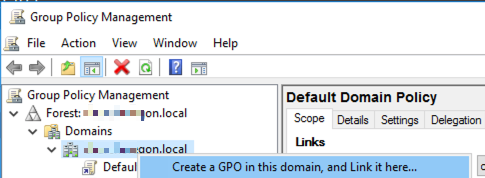

# Microsoft LAPS (Local Administrator Password Security)

## Download and Install LAPS on Active Directory

Download [LAPS](https://www.microsoft.com/en-us/download/details.aspx?id=46899)    
  
Install LAPS on Domain Controler:
  
  
  
Create two security group, one for readers (LAPS-readers) and one for writers (LAPS-reset):  
  

Copy path organisation unit  


Run powershell script (Replace organisation unit path):  
```
Import-module AdmPwd.PS
Update-AdmPwdADSchema

Set-AdmPwdComputerSelfPermission -OrgUnit "CN=Computers,DC=churchoregon,DC=local"
Set-AdmPwdReadPasswordPermission -OrgUnit "CN=Computers,DC=churchoregon,DC=local" -Allowedprincipals "LAPS-readers"

Set-AdmPwdReadPasswordPermission -OrgUnit "CN=Computers,DC=churchoregon,DC=local" -Allowedprincipals "LAPS-reset"
Set-AdmPwdResetPasswordPermission -OrgUnit "CN=Computers,DC=churchoregon,DC=local" -Allowedprincipals "LAPS-reset" 
```  
Open Group Policy Managment:  
  
  
Create new GPO container with LAPS-PWD:    
   
  
  
Edit new GRO LAPS  
  
  
  
Open Computer Configuration -> Polices -> Administrative Template -> LAPS    
  
  
Edit "Password Settings" switch to Enabled  
  
  
Edit "Enable local admin password managment" switch to Enabled   
  
 
## Install LAPS on PC 
  
Need install LAPS on PC, or setup installation use GPO

## How to read password and make reset  
  
Run LAPS UI on DC. Enter Computer name and press "Search".
  
    

## REFERENCES
[INSTALLATION LAPS](https://www.veeam.com/blog/microsoft-laps-deployment-configuration-troubleshoot-guide.html)
