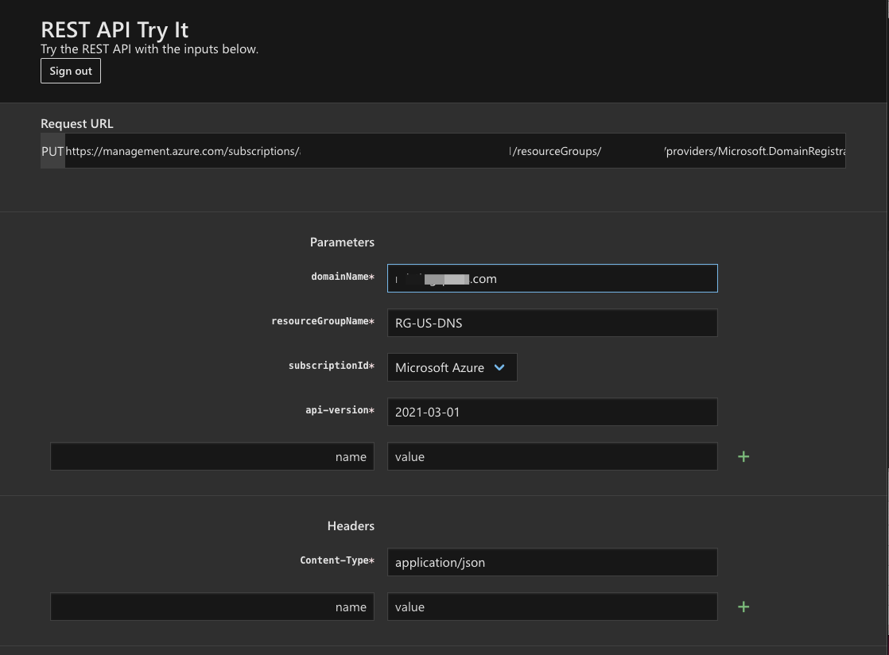
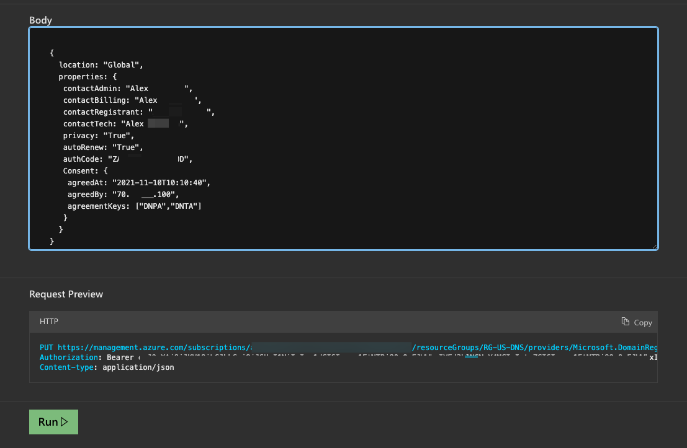
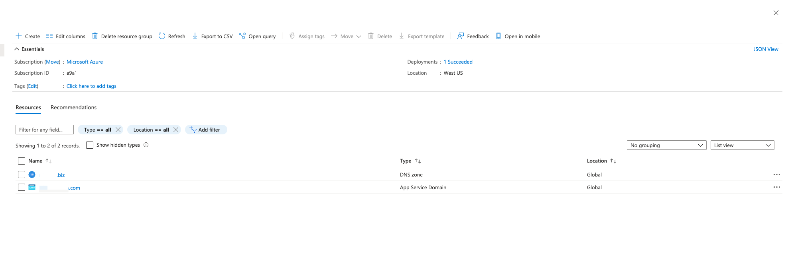
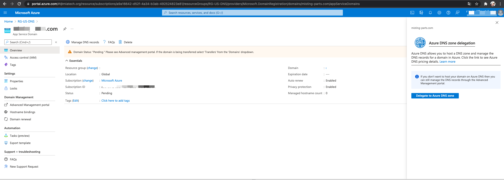
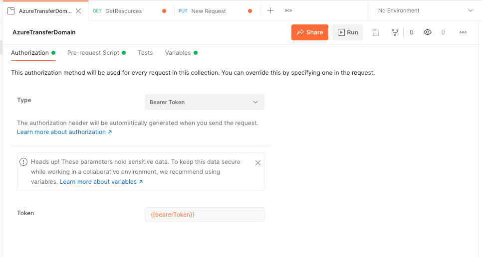

## Table of contents
{: .no_toc .text-delta }

1. TOC
{:toc}
# Domain name registration transfer to Azure App Service domains

Some of the reasons you might want to do this:

    - Take advantage of Microsoft Azure’s flat rate pricing, for all domains, that they have agreed with GoDaddy
    - Single console to control domains, DNS, traffic manager, web sites (app service) etc. etc.
    - Better automation/api functionality (in my opinion) than what some of the domain name hosting companies offer.

## Run migration process on domain registrator 

Go to current domain registrator WEB page, and run process transfer domain to other registrator. 
You will get transfer code by email.  

## Azure move domain
1. Go to https://docs.microsoft.com/en-us/rest/api/appservice/domains/create-or-update#code-try-0 
2. Press "Try it" button on Creates or updates a domain.  
     
3. fill fields with information:  
   domainName - transfered domain name    
   resourceGroupName - Resource group name  
   subscriptionId - select subscribtion  
   api-version - 2021-03-01  
     
4. Body:    
   ```yaml
   {  
     location: "Global",  
     properties: {  
      contactAdmin: "Alex *****",  
      contactBilling: "Alex *****",  
      contactRegistrant: "Alex ****",  
      contactTech: "Alex *****",  
      privacy: "True",  
      autoRenew: "True",  
      authCode: "ZA*********D0D",  
      Consent: {  
       agreedAt: "2021-11-10T10:10:40",  
       agreedBy: "70.**.90.**",  
       agreementKeys: ["DNPA","DNTA"]  
      }  
     }
   }  
   ```
      
5. Press "Run"   
   If you recived code 202 or 200, command run successfully. Need wait when transfer done around 5 days.  
   Response example: 
   ```yaml
      {
      "id": "/subscriptions/a9a16642-****-4a34-****-**********/resourceGroups/RG-US-DNS/providers/Microsoft.DomainRegistration/domains/****-****.com",
      "name": "****-***.com",
      "type": "Microsoft.DomainRegistration/domains",
      "location": "global",
      "properties": {
      "registrationStatus": "Pending",
      "provisioningState": "InProgress",
      "nameServers": [],
      "privacy": true,
      "createdTime": "2012-08-30T07:40:50",
      "autoRenew": true,
      "readyForDnsRecordManagement": false,
      "managedHostNames": [],
      "domainNotRenewableReasons": [
      "ExpirationNotInRenewalTimeRange",
      "RegistrationStatusNotSupportedForRenewal"
      ]
      }
      }
   ```

# Set up DNS zone and delegation domain on AzureAD
1. Go to potral.azure.com and open Resource group where you type on previos step.   
   You will see App Service Domain with your transfered domain name. Open it.  
     
2. Press "Delegate to Azure DNS zone" button, it will create on same Rosource group DNS zone for that domain. 
   
3. Open DNS zone with your transfered domain name, and add all DNS records   

# Make transfer domain use Postman and Azure API 
## Prepare
Go to cloud shell: https://portal.azure.com/#cloudshell/

```yaml
az ad sp create-for-rbac

   {
     "appId": "cb935b8b-****-44e4-****-***********",
     "displayName": "azure-cli-2021-11-10-11-06-21",
     "name": "cb935b8b-****-44e4-****-**********",
     "password": "yEdU~**********~DzjB4",
     "tenant": "c4c4824d-****-498c-****-*********"
   }

# Get Subbscription
az account show --query id -o tsv
  a9a16642-****-4a34-****-************
```
## Postman Settings
1. Create new collection with name "AzureAPI", and set variables on "Variables tab", press save button    
```yaml
clientId - <az ad sp create-for-rbac - appID>
clientSecret - <az ad sp create-for-rbac - password>
tenantId - <az ad sp create-for-rbac - tenant>
subscriptionId - <az account show --query id -o tsv output from commmand>
resource - https://management.azure.com/
bearerToken - <empty>
```  
  
2. Paste on Pre-request Script tab, next script   
```yaml

   if (!pm.collectionVariables.get("bearerToken") || Date.now() > new Date(pm.collectionVariables.get("bearerTokenExpiresOn") * 1000)) {
      pm.sendRequest({
   url: 'https://login.microsoftonline.com/' + pm.collectionVariables.get("tenantId") + '/oauth2/token',
   method: 'POST',
   header: 'Content-Type: application/x-www-form-urlencoded',
   body: {
      mode: 'urlencoded',
      urlencoded: [
         { key: "grant_type", value: "client_credentials", disabled: false },
         { key: "client_id", value: pm.collectionVariables.get("clientId"), disabled: false },
         { key: "client_secret", value: pm.collectionVariables.get("clientSecret"), disabled: false },
         { key: "resource", value: pm.collectionVariables.get("resource") || "https://management.azure.com/", disabled: false }
      ]
   }
}, function (err, res) {
      if (err) {
      console.log(err);
} else {
      let resJson = res.json();
      pm.collectionVariables.set("bearerTokenExpiresOn", resJson.expires_on);
      pm.collectionVariables.set("bearerToken", resJson.access_token);
}
});
}
```  
3. On Authorization tab select "Type" Bearer Token, Token {{bearerToken}}, and press save button
   
4. Add in collection new Get request with name GetResources  
   On Params tab, Key: api-version, VALUE: 2020-09-01 and press Send. 
   You will get 200 Ok Response with list of resources on your tenant.  
5. Add in collection new PUT request with name TransferDomain
   URL: https://management.azure.com/subscriptions/{{subscriptionId}}/resourceGroups/{resourceGroupName}}/providers/Microsoft.DomainRegistration/domains/{domain name}?api-version=2021-03-01
   On Body tab, switch to raw mode and paste next JSON block: 
   ```yaml
      {  
      location: "Global",  
      properties: {  
      contactAdmin: "Alex *****",  
      contactBilling: "Alex ****",  
      contactRegistrant: "Alex ****",  
      contactTech: "Alex ****",  
      privacy: "True",  
      autoRenew: "True",  
      authCode: "ZA******0D",  
      Consent: {  
      agreedAt: "2021-11-10T10:10:40",  
      agreedBy: "70.**.90.***",  
      agreementKeys: ["DNPA","DNTA"]  
      }  
      }
      }
   ```
   6. press Send button
# Reference
1. https://jrudlin.github.io/2018/10/27/domain-name-registration-transfer-to-azure-app-service-domains/  
2. https://blog.jongallant.com/2021/02/azure-rest-apis-postman-2021/  

