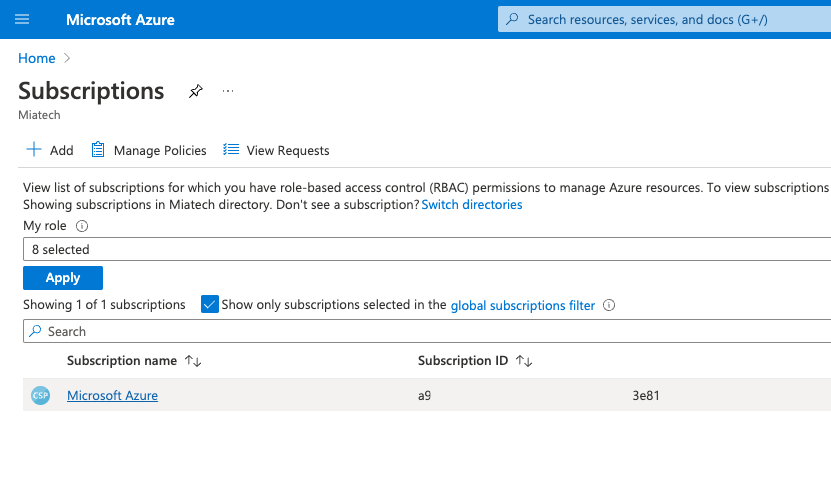
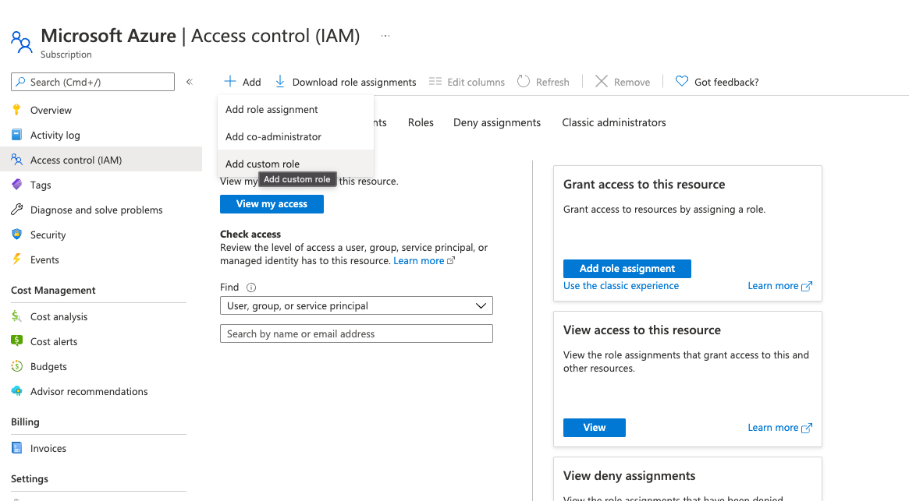
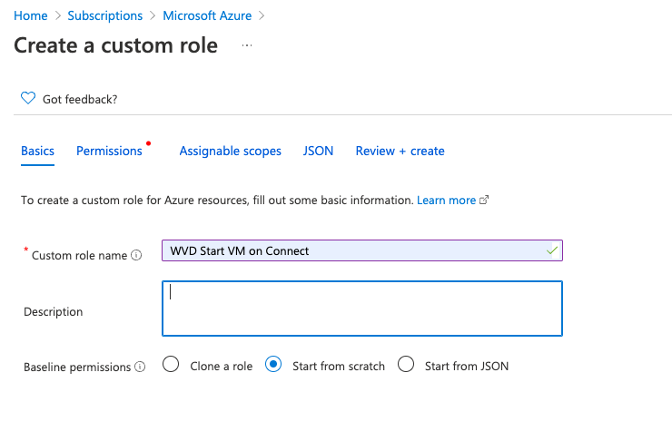
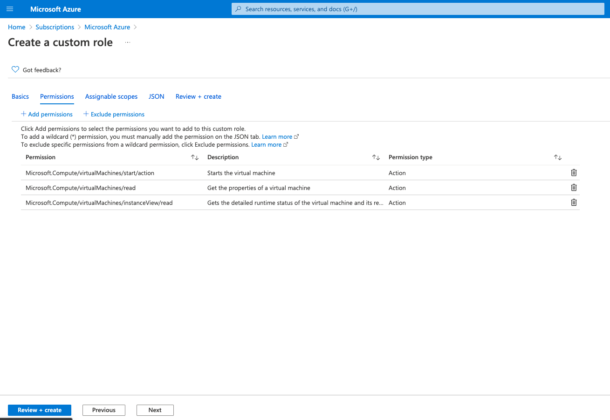
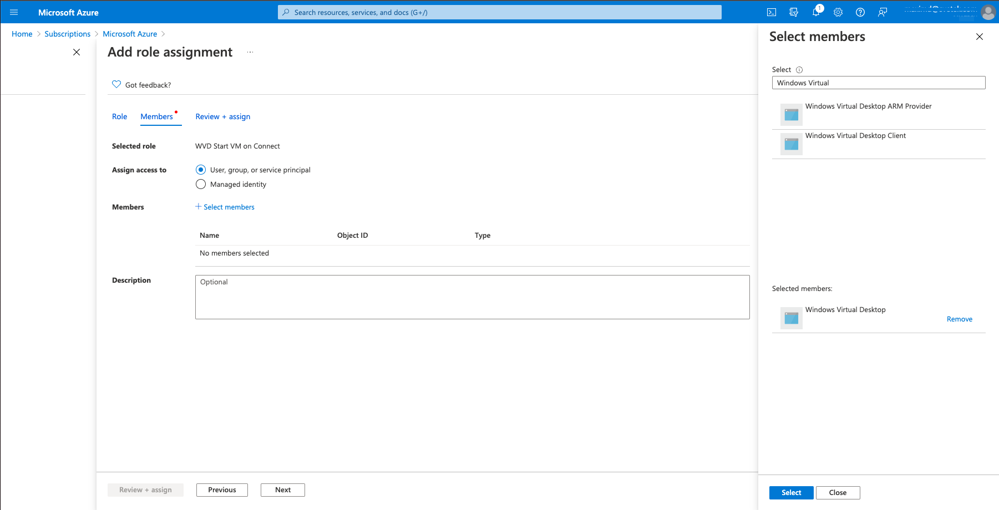
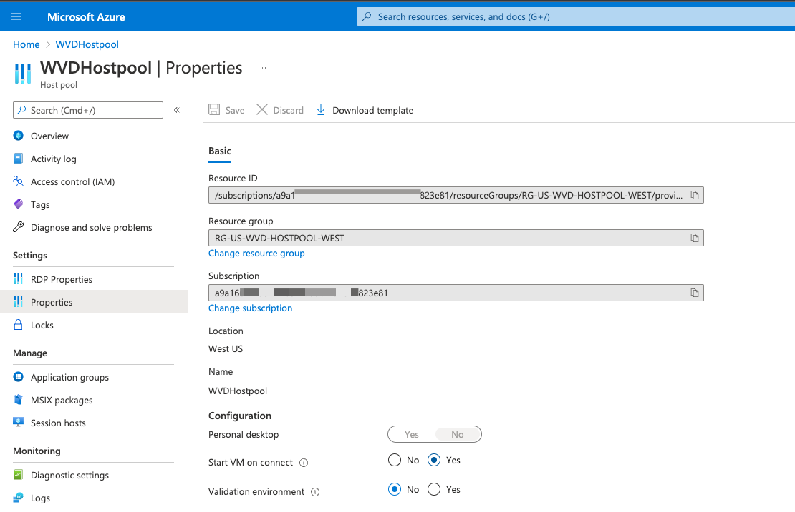

## Table of contents
{: .no_toc .text-delta }

1. TOC
{:toc}
# Deploy Azure Virtual Desktop (WVD) HOSTPOOL  
  --- on moderation ---
## Auto Start Virtual Machine on Connect
The Start Virtual Machine (VM) on Connect feature lets you save costs by allowing end users to turn on their VMs only when they need them. You can then turn off VMs when they're not needed.  
### Create a custom role for Start VM on Connect
Before you can configure the Start VM on Connect feature, you'll need to assign your VM a custom RBAC (role-based access control) role. This role will let Azure Virtual Desktop manage the VMs in your subscription.  

1. Open the Azure portal and go to Subscriptions.
      
2. Go to Access control (IAM) and select Add a custom role.  
       
3. Next, name the custom role and add a description. We recommend you name it “start VM on connect.”  
     
4. On the Permissions tab, add one of the two following sets of permissions to the subscription you're assigning the role to:  
```yaml
Microsoft.Compute/virtualMachines/start/action
Microsoft.Compute/virtualMachines/read
Microsoft.Compute/virtualMachines/instanceView/read 
```
  
5. When you're finished, select Ok.

After that, you'll need to assign the role to grant access to Azure Virtual Desktop.
To assign the custom role:
1. In the Access control (IAM) tab, select Add role assignments.
     

2. Select the role you just created.
     

3. In the search bar, enter and select Windows Virtual Desktop (this will soon be updated to "Azure Virtual Desktop").

### Configure the Start VM on Connect feature  
Start VM on Connect is a host pool setting. If you only want a select group of users to use this feature, make sure you only assign the required role to the users you want to add.  
To use the Azure portal to configure Start VM on Connect:
1. Open your browser and go to the Azure portal.
2. In the Azure portal, go to Azure Virtual Desktop.
3. Select Host pools, then go to the host pool where you want to enable the setting.
4. In the host pool, select Properties. Under Start VM on connect, select Yes, then select Save to instantly apply the setting.  
     

### REFERENCES  
[Microsoft Start Virtual Machine on Connect](https://docs.microsoft.com/en-us/azure/virtual-desktop/start-virtual-machine-connect)

# Prepare AVD VM (WVD)
## ENABLE Acelerator Network on VM D2sV4

For enable Acelerated network for AVD VMs, on Azure VM Domain controler need run next powershell script for each AVD VM.    
Don't forget changes $VMWVDNAME when you run script.   
```bash
$VMResGroup="RG-US-WVD-VM-WEST"
$VMWVDNAME="vm-wvd-west-2111" 

 # Acelerator Network Enabled 
$nic = Get-AzNetworkInterface -ResourceGroupName $VMResGroup -Name $VMWVDNAME
$nic.EnableAcceleratedNetworking = $true
$nic | Set-AzNetworkInterface 
```

## JOIN VMs AVD (WVD) TO AD
```bash
add-computer –domainname "mia****.local"  -restart
```

## Create storage account on Azure for FSLogix user profile 

That script connecting to your Azure subscription,   
```bash
#Create temp folder
New-Item -Path 'C:\temp' -ItemType Directory -Force | Out-Null

# Download AzFilesHybrid files for connect to Azure and extract them  
$wc = New-Object System.Net.WebClient
Write-Output $wc.DownloadFileTaskAsync("https://github.com/Azure-Samples/azure-files-samples/releases/download/v0.2.3/AzFilesHybrid.zip", "C:\temp\AzFilesHybrid.zip")

Expand-Archive -LiteralPath 'C:\temp\AzFilesHybrid.zip' -DestinationPath C:\temp\AzFilesHybrid
cd C:\temp\AzFilesHybrid 

Set-ExecutionPolicy -ExecutionPolicy Unrestricted -Scope CurrentUser
#Install-PackageProvider -Name NuGet -Force
Import-Module -Name .\AzFilesHybrid.psd1

# Connect to Azure Subscription 
Connect-AzAccount

# Need edit params
$location = "westus2"
$SubscriptionId = "Microsoft Azure Sponsorship"
$ResourceGroupName = "RG-US-WVD-INFRA-WEST"
$StorageAccountName = "ch*****"
$DomainAccountType = "ServiceLogonAccount" # ComputerAccount or ServiceLogonAccount
$OrganizationalUnitDistinguishedName = "OU=azure,DC=ch******,DC=local"

Select-AzSubscription -SubscriptionName $SubscriptionId

# List current storage accounts  
Get-AzStorageAccount -ResourceGroupName $ResourceGroupName

# Create new storage account for FSLogix user profiles 
New-AzStorageAccount -ResourceGroupName $resourceGroupName `
  -Name $StorageAccountName `
  -Location $location `
  -SkuName Standard_LRS `
  -Kind StorageV2

# Join storage account to the Domain controller   
join-AzStorageaccountForAuth -ResourceGroupName $ResourceGroupName -Name $StorageAccountName -DomainAccountType $DomainAccountType -OrganizationalUnitDistinguishedName $OrganizationalUnitDistinguishedName
$storageaccount = Get-AzStorageAccount -ResourceGroupName $resourceGroupName -Name $StorageAccountName
$storageaccount.AzureFilesIdentityBasedAuth.DirectoryServiceOptions
$storageaccount.AzureFilesIdentityBasedAuth.ActiveDirectoryProperties
```
## Create SMB file share for store FSLogix profiles  
Open portal.azure.com and goto storage account.  
Press New fileshare and type name: fslogixpe    
  

## Create 2 Security Groups on DC on OU synced to Azure AD:
    FSLogix Share Elevated Contributor
    FSLogix Share Contributor

You can use only one Security Group "FSLogix Share Contributor" for provide access to FSLogix profiles.  
If you want make changes NTFS permissions, need second group "FSLogix Share Elevated Contributor" for admin staff.  

Add members AVD Users to the FSLogix Share Contributor Group and need make sync use Azure Connect!!!

## Grand access for security groups access to fileshare fslogixpe  
Open portal.azure.com and goto storage account.  
Goto "Access Control (IAM)" -> "Role assignments"  
Add groups FSLogix Share Elevated Contributor as role Storage File Data SMB Share Elevated Contributor  
and FSLogix Share Contributor as role Storage File Data SMB Share Contributor   


## Try mount share on DC and AVD VMs 
Try mount share on DC and AVD VMs and make sure users have access to the share without type login and passwords.  
```bash
net use W: \\ch*****.file.core.windows.net\fslogixpe /user:Azure\churchwvd
```

## Install DUO MFA Agent, AVD Agent, FSLogix Agent on AVD (WVD) VMs  
That script will be download msi packages DUO MFA agent, FSLogix Agent, AVD Agent. When download done, all software will be installed automaticaly with settings in variables. Also script setup RDP session timers.   
Before run that script please edit all variables.  
```bash
$registryPath = "HKLM:\SOFTWARE\FSLogix\Profiles"
$FslogixSharePath =  "\\churchwvd.file.core.windows.net\fslogixpe"

$DouIKEY = "DIXXXXXXXXXXXXXXXXXXXX"
$DuoSKEY = "xxxxxxxxxxxxxxxxxxxxxxxxxxxxxx"
$DouHostAPI = "api-xxxxxxxx.duosecurity.com"
$DouArguments = @('/S', '/V"', '/qn', "IKEY=$DouIKEY", "SKEY=$DuoSKEY", "HOST=$DouHostAPI", 'AUTOPUSH="#1"', 'FAILOPEN="#1"', 'SMARTCARD="#0"', 'RDPONLY="#0"', 'UAC_PROTECTMODE=#2')


$scriptStartTime = get-date

#Create temp folder
New-Item -Path 'C:\temp\apps' -ItemType Directory -Force | Out-Null

#Download all source file async and wait for completion
$scriptActionStartTime = get-date
Write-host ('*** STEP 0 : Download all sources [ '+(get-date) + ' ]')
$files = @(
    @{url = "https://dl.duosecurity.com/duo-win-login-latest.exe"; path = "c:\temp\apps\duo-win-login-latest.exe"}
    @{url = "https://download.microsoft.com/download/4/8/2/4828e1c7-176a-45bf-bc6b-cce0f54ce04c/FSLogix_Apps_2.9.7654.46150.zip"; path = "c:\temp\apps\fslogix.zip"}
    @{url=  "https://query.prod.cms.rt.microsoft.com/cms/api/am/binary/RWrmXv"; path = "c:\temp\apps\Microsoft.RDInfra.RDAgent.Installer-x64-1.0.3050.2500.msi"}
    @{url=  "https://query.prod.cms.rt.microsoft.com/cms/api/am/binary/RWrxrH"; path = "c:\temp\apps\Microsoft.RDInfra.RDAgentBootLoader.Installer-x64.msi"}
)

foreach ($f in $files)
{
    Write-Output "DOWNLOAD $f"
    $wc = New-Object System.Net.WebClient
    Write-Output $wc.DownloadFileTaskAsync($f.url, $f.path)
}

$scriptActionDuration = (get-date) - $scriptActionStartTime
Write-Host "Total source Download time: "$scriptActionDuration.Minutes "Minute(s), " $scriptActionDuration.seconds "Seconds and " $scriptActionDuration.Milliseconds "Milleseconds"

#Install FSLogix
$scriptActionStartTime = get-date
Write-host ('*** STEP 1 : Install FSLogix Apps [ '+(get-date) + ' ]')
Expand-Archive -Path 'C:\temp\apps\fslogix.zip' -DestinationPath 'C:\temp\apps\fslogix\'  -Force
Start-Sleep -Seconds 10
Start-Process -FilePath 'C:\temp\apps\fslogix\x64\Release\FSLogixAppsSetup.exe' -ArgumentList '/install /quiet /norestart' -Wait
$scriptActionDuration = (get-date) - $scriptActionStartTime
Write-Host "*** FSLogix Install time: "$scriptActionDuration.Minutes "Minute(s), " $scriptActionDuration.seconds "Seconds and " $scriptActionDuration.Milliseconds "Milleseconds"


#Configure FSLogix
New-ItemProperty -Path $registryPath -Name "Enabled" -Value 1 -PropertyType DWORD -Force | Out-Null
New-ItemProperty -Path $registryPath -Name "DeleteLocalProfileWhenVHDShouldApply" -Value 1 -PropertyType DWORD -Force | Out-Null
New-ItemProperty -Path $registryPath -Name "PreventLoginWithFailure" -Value 1 -PropertyType DWORD -Force | Out-Null

# MULTIPLY SESSIONS
New-ItemProperty -Path $registryPath -Name "ConcurrentUserSessions" -Value 1 -PropertyType DWORD -Force | Out-Null
New-ItemProperty -Path "HKEY_LOCAL_MACHINE\SOFTWARE\Policies\FSLogix\ODFC" -Name "ConcurrentUserSessions" -Value 1 -PropertyType DWORD -Force | Out-Null

New-ItemProperty -Path $registryPath -Name "VHDLocations" -Value $FslogixSharePath -PropertyType MultiString -Force | Out-Null
 ######################
# Install DUO Login https://help.duo.com/s/article/1090?language=en_US

echo $DouArguments

$scriptActionStartTime = get-date
Write-host ('*** STEP 1 : Install DOU Apps [ '+(get-date) + ' ]')
Start-Process -FilePath 'c:\temp\apps\duo-win-login-latest.exe' -ArgumentList $DouArguments -Wait
$scriptActionDuration = (get-date) - $scriptActionStartTime
Write-Host "*** DOU Install time: "$scriptActionDuration.Minutes "Minute(s), " $scriptActionDuration.seconds "Seconds and " $scriptActionDuration.Milliseconds "Milleseconds"

# Set params for RDP sessions timers
reg add "HKLM\SOFTWARE\Policies\Microsoft\Windows NT\Terminal Services" /v fResetBroken /t REG_DWORD /d 1 /f
reg add "HKLM\SOFTWARE\Policies\Microsoft\Windows NT\Terminal Services" /v MaxIdleTime /t REG_DWORD /d 43200000 /f
reg add "HKLM\SOFTWARE\Policies\Microsoft\Windows NT\Terminal Services" /v MaxConnectionTime /t REG_DWORD /d 43200000 /f
reg add "HKLM\SOFTWARE\Policies\Microsoft\Windows NT\Terminal Services" /v MaxDisconnectionTime /t REG_DWORD /d 600000 /f
reg add "HKLM\SOFTWARE\Policies\Microsoft\Windows NT\Terminal Services" /v RemoteAppLogoffTimeLimit /t REG_DWORD /d 0 /f

reg add "HKLM\SOFTWARE\Policies\Microsoft\Windows NT\Printers\PointAndPrint" /v NoWarningNoElevationOnInstall /t REG_DWORD /d 1 /f
reg add "HKLM\SOFTWARE\Policies\Microsoft\Windows NT\Printers\PointAndPrint" /v UpdatePromptSettings /t REG_DWORD /d 1 /f

```
Read logs: %ProgramData%\FSLogix\Logs

---
# REFERENCES
[Original Microsoft Policies TerminalServer-Server](https://admx.help/?Category=Windows_8.1_2012R2&Policy=Microsoft.Policies.TerminalServer-Server::TS_SESSIONS_RemoteApp_End_Timeout)


