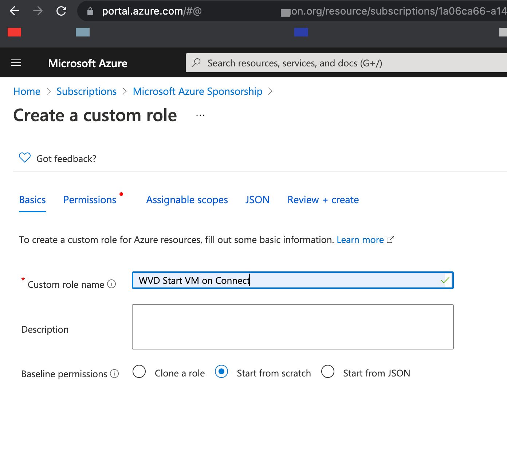
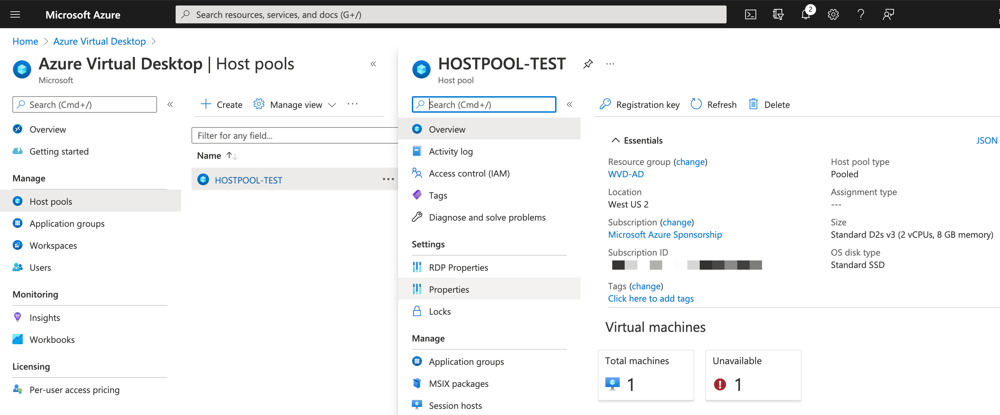
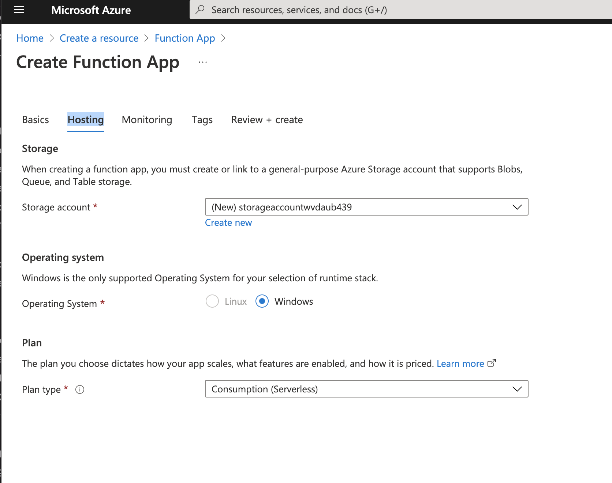
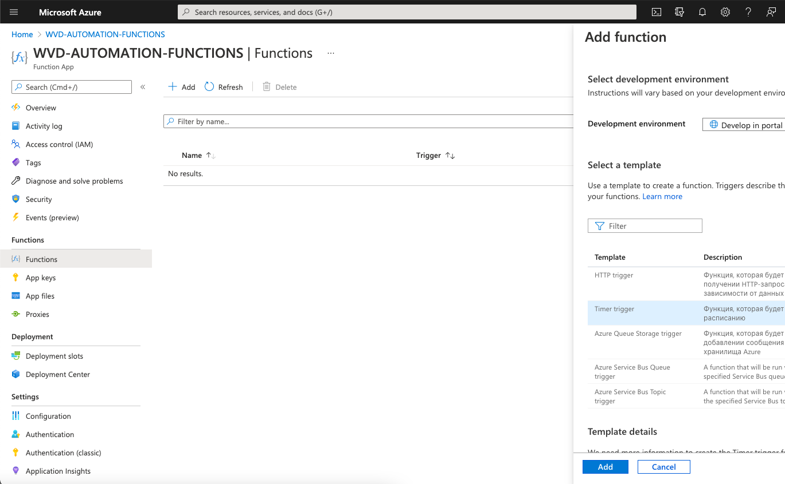

## Table of contents
{: .no_toc .text-delta }

1. TOC 
{:toc}
   
# AVD Start and Stop VMs (WVD)  
## AVD Auto Start VM when user connecting 
### Set permissions for AVD start VMs  
Firstly need add permissions WVD services for start VM if they stoped.   
  
Go to on portal.azure.com -> Home -> Subscription -> < Subscription name > -> Access control (IAM)
   
    
  
Press +Add -> Add custom role

  
  
Role name: WVDStartVMonConnect  
and press "Next"  

On permissions step press +Add permissions and select the permissions you want to grant for this role. Like mentioned above you need:

* Microsoft.Compute/virtualMachines/start/action
* Microsoft.Compute/virtualMachines/read
  
  
  
  
press Review + create  and create  
Once the task is completed, you will get the following notification. press Ok button.  
  
  
Go to again Home -> Subscription -> < Subscription name > -> Access control (IAM)  
and press "Add role assigment"   

  

Role: WVDStartVMonConnect   
Select: Windows Virtual Desktop  and double click for select, press Save button  

Now you just need to pick the recently created role, which is WVDStartVMOnConnect in my case, and assign access to Windows Virtual Desktop as a service. Once this is done, the role assignment completed successfully.   
  
   
  
### Setup settings on AVD Hostpool settings  

All you need to do is to log into the Azure Portal using: https://portal.azure.com and navigate to the Azure Virtual Desktop -> Host pools -> select hostpool.  

   

Go to Properties and select "Start VM on connect" to "YES"

   

Also select correct "Load balancing algorithm":  
  
Breadth-first load balancing distributes new user sessions across all available session hosts in the host pool.   
  
Depth-first load balancing distributes new user sessions to an available session host with the highest number of connections but has not reached its maximum session limit threshold.  

Setup "Max session limit" per VM  

press "Save" button.  
Configurations done.  

## AVD Auto Stop VM when no active sessions on VM  

  
  
Resource group: (create new) WVD-AUTOMATION  
Function App name: WVD-AUTOMATION-FUNCTIONS  
Runtime stack: PowerShell Core  

  
  
and press "Next:Hosting"  

  
  
and press "Next:Monitoring"  

  
  
press "Review + Create"  and "Create"  
  
Go to resource "WVD-AUTOMATION-FUNCTIONS"  - > Identity  

Switch "Status" to "On"  
  
  
press "Save" you will get information like "Enable system assigned ....", press "Yes"  

  
  
Go to "App file" and select file requirements.psd1  
uncomment line  'Az' = '6.*'  and press "Save"  
  


select host.json file and add 

```
,
"logging": {
"logLevel": {
"default": "Trace"
}
}
```

  
  
for logging details trace mode, press "Save"  
  
go to "Overview"  and press "Restart"  

Next, go to the Session Host VM Resource Group.  It is possible to deploy Session Host to a Resource Group different from the Windows Virtual Desktop Host Pool.  Be sure to set RBAC permissions on the VM Resource Group.  

  
  
Open Access Control (IAM) from the Resource Group.  

Click Add a Role Assignment  

  
  
Set: 
Role: as Contributor 
  
and select the Managed Identity setup in the previous step "WVD-AUTOMATION-FUNCTIONS".   
  
Click Save when finished.  
  
Create the Functions 
Go to the functions "WVD-AUTOMATION-FUNCTIONS" -> Functions -> +Add 
  
select Time trigger and press "Add" button  


  
Click in "Code + Test"  
change PowerShell script: 
and change 2 params: 
 * HostPool   = "WVDHostpool"; 
 * HostPoolRG = "RG-US-WVD-HOSTPOOL-WEST"

```
# Input bindings are passed in via param block.
# For the Function App
param($Timer)

######## Variables ##########
## Update "HostPool" value with your host pool, and "HostPoolRG" with the value of the host pool resource group.
## See the next step if working with multiple host pools.
$allHostPools = @()
$allHostPools += (@{
        HostPool   = "WVDHostpool";
        HostPoolRG = "RG-US-WVD-HOSTPOOL-WEST"
    })

# If using multiple host pools, Copy the block the code below and pasted it above this line.  Update with the host pool name and resource group.
# Repeat for each additional host pool.
<#
$allHostPools += (@{
        HostPool   = "<HostPoolName>";
        HostPoolRG = "<HostPoolResourceGroup>"
    })
#>

########## Script Execution ##########
$count = 0
while ($count -lt $allHostPools.Count) {
    $pool = $allHostPools[$count].HostPool
    $poolRg = $allHostPools[$count].HostPoolRG
    Write-Output "This is the key (pool) $pool"
    write-output "this is the value (rg) $poolRg"
    # Get the active Session hosts
    try {
        $activeShs = (Get-AzWvdUserSession -ErrorAction Stop -HostPoolName $pool -ResourceGroupName $poolRg).name
    }
    catch {
        $ErrorMessage = $_.Exception.message
        Write-Error ("Error getting a list of user sessions: " + $ErrorMessage)
        Break
    }
    
    $allActive = @()
    foreach ($activeSh in $activeShs) {
        $activeSh = ($activeSh -split { $_ -eq '.' -or $_ -eq '/' })[1]
        if ($activeSh -notin $allActive) {
            $allActive += $activeSh
        }
    }
    # Get the Session Hosts
    # Exclude servers in drain mode and do not allow new connections
    try {
        $runningSessionHosts = (Get-AzWvdSessionHost -ErrorAction Stop -HostPoolName $Pool -ResourceGroupName $PoolRg | Where-Object { $_.AllowNewSession -eq $true } )
    }
    catch {
        $ErrorMessage = $_.Exception.message
        Write-Error ("Error getting a list of running session hosts: " + $ErrorMessage)
        Break
    }
    $availableSessionHosts = ($runningSessionHosts | Where-Object { $_.Status -eq "Available" })
    #Evaluate the list of running session hosts against 
    foreach ($sessionHost in $availableSessionHosts) {
        $sessionHostName = (($sessionHost).name -split { $_ -eq '.' -or $_ -eq '/' })[1]
        if ($sessionHostName -notin $allActive) {
            Write-Host "Server $sessionHostName is not active, shut down"
             try {
                 # Stop the VM
                 Write-Output "Stopping Session Host $sessionHostName"
                 Get-azvm -ErrorAction Stop -Name $sessionHostName | Stop-AzVM -ErrorAction Stop -Force -NoWait
             }
            catch {
                $ErrorMessage = $_.Exception.message
                Write-Error ("Error stopping the VM: " + $ErrorMessage)
                Break
            }
        }
        else {
            write-host "Server $sessionHostName has an active session, won't shut down"
        }
    }
    $count += 1
}
```
Press Save and Test/Run for testing script 

  

  
