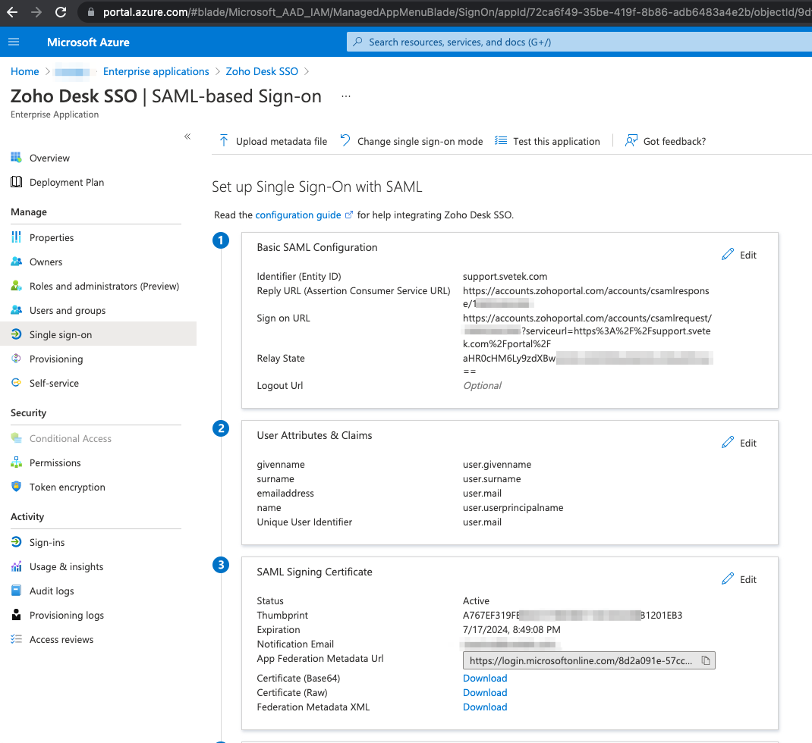

# ZOHO Desk SSO with Azure AD 

### Microsoft Azure AD
This section describes how to configure Microsoft Azure Active Directory to provide SSO for your Zoho Desk Help Center.
1. Sign in to your Azure AD portal with an administrator account.
2. In the Azure portal, on the left navigation pane, click Azure Active Directory.
3. Select Enterprise Applications and then All Applications.
4. Click the New Application button.
5. In the search box, type SAML SSO, select Confluence SAML SSO by Microsoft from result panel then click Add to add the application to your portal.
6. Navigate back to Enterprise Applications and then click Confluence SAML SSO by Microsoft app.
7. Click Single sign-on and then choose SAML for Mode.
8. On the Set up Single Sign-On with SAML page, click Edit icon to open Basic SAML Configuration dialog.
      
9. On the Basic SAML Configuration section, do the following:
      
   * In the Identifier text box, enter zoho.com
   * Note(1): If the IdP doesn't support a duplicate Identifier, you can edit the Entity ID field in Zoho Desk to select the alternative and enter the same.
   * Note(2): If you are on the .eu domain enter zoho.eu. Likewise, enter zoho.in if you are on the .in domain.
   * In the Reply URL text box, paste the value for SAML Response URL that you copied from the SAML screen in Zoho Desk.
   * In the Sign-on URL text box, paste the value for Redirect URL (For Microsoft Azure) that you copied from the SAML screen in Zoho Desk.
   * In the Relay State text box, paste the value for Default Relay State that you copied from the SAML screen in Zoho Desk.
   * Check the radio boxes for the entered values.
   * Click Save at the top of the page.
10. On the Set up Single Sign-On with SAML page, click the Edit button to open User Attributes & Claims dialog.
11. In the User Attributes section on the User Attributes & Claims dialog, do the following:
   * Click Edit icon to open the Manage user claims dialog.
   * From the Source attribute list, select the attribute value user.mail.
   * Click Save.
12. Go to SAML Signing Certificate menu and do the following:
   * In the Signing Option drop-down list, choose Sign SAML response.
   * This enables Azure AD to sign the SAML response with the X.509 certificate of the application.
   * Click Save to apply the new SAML signing certificate settings.
   * Download the certificate by clicking Certificate (PEM).
13. Go to Set up Confluence SAML SSO by Microsoft menu and do the following:
   * Copy the Login URL and paste it into the Remote Login URL and the Reset Password URL field in Zoho Desk SAML page.
   * Copy the Logout URL and paste it into the Remote Logout URL field in Zoho Desk SAML page.
   * Upload the certificate you saved in Step 12 into the Public Key field in Zoho Desk SAML page.
14. Click Save.
15. Back in Zoho Desk, check the Enable Signup option on the SAML page to allow new users to log in for the first time and then click Save.  
  
Original URL: https://help.zoho.com/portal/en/kb/desk/for-administrators/user-access-and-security/articles/setting-up-saml-single-signon-for-help-center#Microsoft_Azure_AD  
