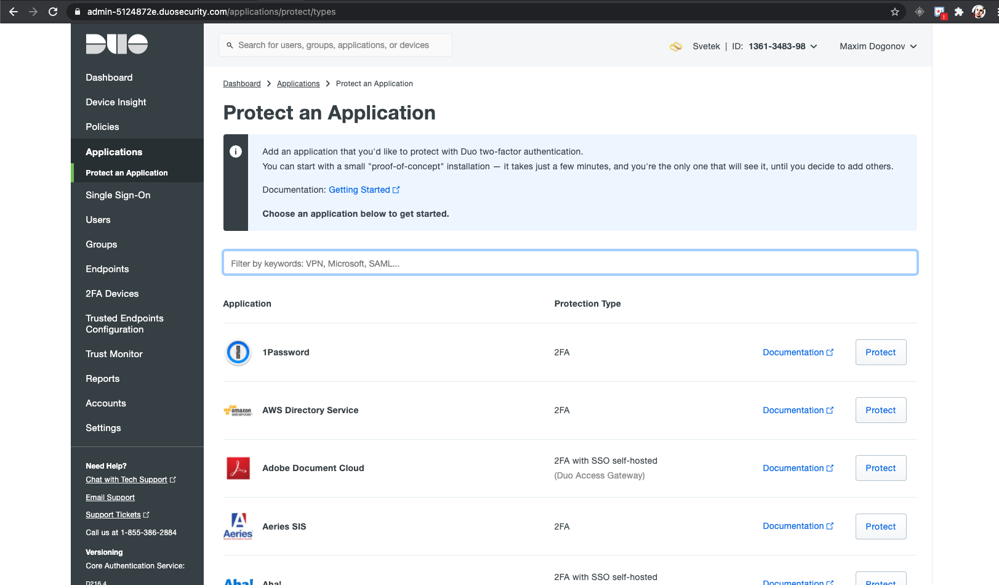
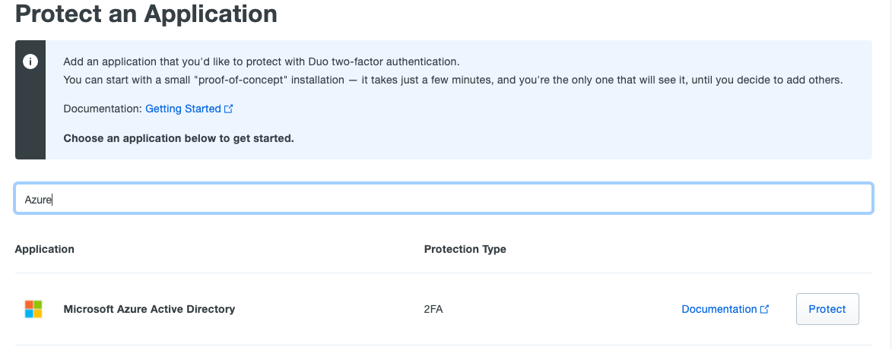
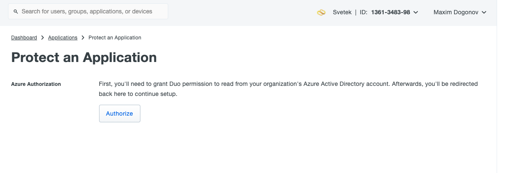
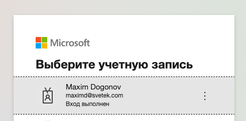

# DUO protect application Microsoft Azure Active Directory
## 

Login https://duosecurity.com 
and go to Application - Protect an Application  

In search field type Azure Active Directory.
And press Protect button on Microsoft Azure Active Directory line. 

Next step press Autorize button 

Next step need type Azure AD Admin auth credentials

to be continued ....!!!