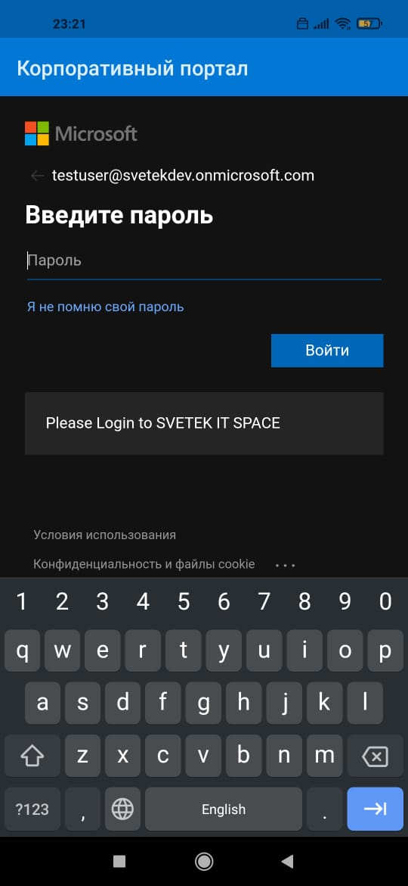

# Intune setup

## Azure Intune configuration 

### Need Setup MDM and MAM 
Go to Azure Active Directory | Mobility (MDM and MAM)  
https://portal.azure.com/?l=en.en-us#blade/Microsoft_AAD_IAM/ActiveDirectoryMenuBlade/Mobility

Select Item Microsoft "Microsoft Intune"

Switch MDM user scope to ALL  
Switch MAM user scope to ALL

### Assign Licence Microsot Intune for user security group
Go to Azure Active Directory | Licenses | All Products  
https://portal.azure.com/?l=en.en-us#blade/Microsoft_AAD_IAM/LicensesMenuBlade/Products  

Select License "Microsoft 365 E5 Developer (without Windows and Audio Confere", go to Licensed groups and press + Assign  

Need to be sure Microsoft Intune License is on. Save. 

### Company Branding 
Need setup company branding for setup Logos, background pictures  
Go to Azure Active Directory | Company branding  | Press + New language  
https://portal.azure.com/?l=en.en-us#blade/Microsoft_AAD_IAM/ActiveDirectoryMenuBlade/LoginTenantBranding  
  

Fill in all the fields and attach Background pictures (mage size: 1920x1080px) and logo  
Banner logo | Image size: 280x60px | File size: 10KB | File type: Transparent PNG, JPG, or JPEG  
Square logo image | Image size: 240x240px (resizable) | Max file size: 50KB | PNG (preferred), JPG, or JPEG
Square logo image, dark theme | Image size: 240x240px (resizable) | Max file size: 50KB | PNG (preferred), JPG, or JPEG  

## Endpoint configuration settings for Android devices

Docs on Microsoft https://docs.microsoft.com/en-us/troubleshoot/mem/intune/configure-android-enterprise-devices-intune

Go to Endpoint Configuration    
https://endpoint.microsoft.com/#home

### Setup Android enrollment 
Go to Devices | Android | Android enrollment  
https://endpoint.microsoft.com/?l=en.en-us#blade/Microsoft_Intune_DeviceSettings/DevicesAndroidMenu/androidEnrollment  

for this step you need Google account Enterprise for make Azure access to Google play apps. And Azure used that account for download and setup apps on Android phones.  

Press "Managed Google Play" button  
Check "I agree." on "1. I grant Microsoft permission to send both user and device information to Google. Learn more.
" and press "Launch Google to connect now" button. 

### Enable Android enterprise work profile enrollment
1. From the Intune portal, go to Device Enrollment > Enrollment Restrictions, and then select Default under Device Type Restrictions.  

2. Select Properties > Select platforms, select Block for Android, select Allow for Android work profile, select OK, and then select Save to save your changes.  

### Deploy applications
After your Intune account is connected to your Android enterprise account, you can deploy some applications by following these steps:  
1. Go to Apps | All apps | Add  
2. In the Select app type pane, locate the available Store app types, and then select Managed Google Play app.  
3. Search for an app to view the app details. Intune Company Portal app.  
4. On the page that displays the app, select Approve. A window for the app opens and prompts you to give permissions for the app to perform various operations.  
5. Select Approve again to accept the app permissions.  
6. On the Approval Settings tab, select Keep approved when app requests new permissions, and then select Save.  
7. Click Select to select the app.  
8. Select Sync at the top to sync the app with the Managed Google Play service.  
9. Select Refresh to update the app list and display the newly added app.
10. After the app is added to Microsoft Intune, you can assign the app to users and devices.  
    go to Apps | All Apps and look under Manage to see the app displayed in the list.
11. To assign the app to a group, select the app that you want to assign. In the Manage section of the menu, select Properties, and then select Edit next to Assignments to open the Add group pane.      
12. In the Assignments tab, under Required, select Add group, select the groups to include, and then select Select.  
13. On the Assign pane, select Review + save to complete the included groups selection.   
14. On the Assignments pane, select Save to save your changes.  
15. Return to the App Properties view, and verify the app under Assignments.

You can also add additional apps and assign to Security group. 

### Connect Android Phone to the Microsoft Intune  
1. Download from Google Play app Microsoft Corporate Portal  
2. Run Microsoft Corporate Portal  and make login use Azure credentional  

  

  

  

  

  

  

  

  

