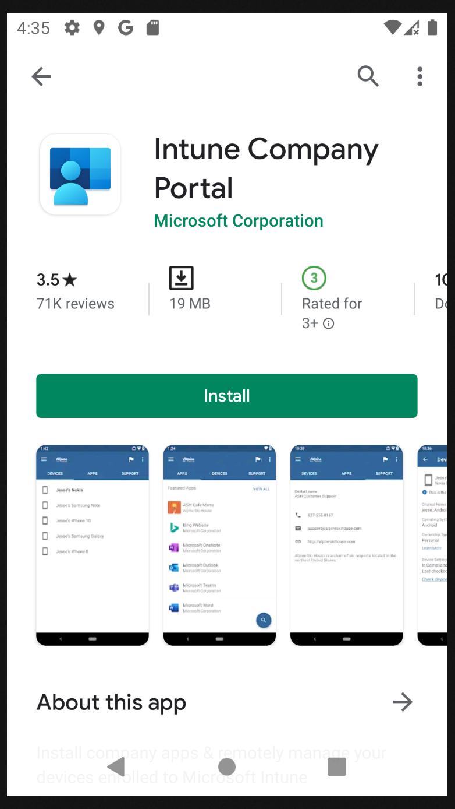

# Bring your own devices
Open Play Market on your own Android Devices  

Type in search field "Microsoft Portal" and select "Intune Company Portal" app  

Press "Install"  

When install is done, press "Open"  

When Microsoft Portal is up, press "Sign in" button  

Enter you corporate user name and password  

Tap "Skip for now"

Tap "Begin" button

Tap "Continue"

Tap "Accept & Continue"

Tap "Continue"

Tap "Done"

Tap "Got it"

After all steps, your own devices will be install on work profile all apps

Now, you can use corporate apps for secure work communications. 

To be continued....