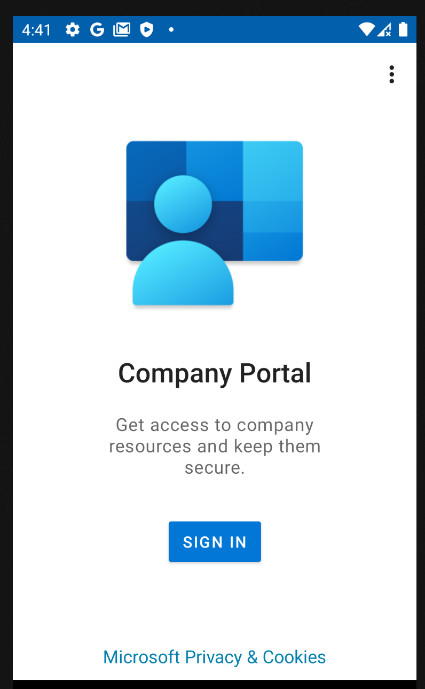

# Bring your own devices
{:height="600px" width="400px"}  
Open Play Market on your own Android Devices    

{:height="600px" width="400px"}  
Type in search field "Microsoft Portal" and select "Intune Company Portal" app    

{:height="600px" width="400px"}  
Press "Install"   

{:height="600px" width="400px"}  
When install is done, press "Open"   

{:height="600px" width="400px"}  
When Microsoft Portal is up, press "Sign in" button   

{:height="600px" width="400px"}  
Enter you corporate user name and password    

{:height="600px" width="400px"}  
Tap "Skip for now"  

{:height="600px" width="400px"}  
Tap "Begin" button  

{:height="600px" width="400px"}  
Tap "Continue"  

{:height="600px" width="400px"}  
Tap "Accept & Continue"  

{:height="600px" width="400px"}  
Tap "Continue"  

{:height="600px" width="400px"}  
Tap "Done"  

{:height="600px" width="400px"}  
Tap "Got it"  

{:height="600px" width="400px"}  
After all steps, your own devices will be install on work profile all apps  

Now, you can use corporate apps for secure work communications. 

To be continued....