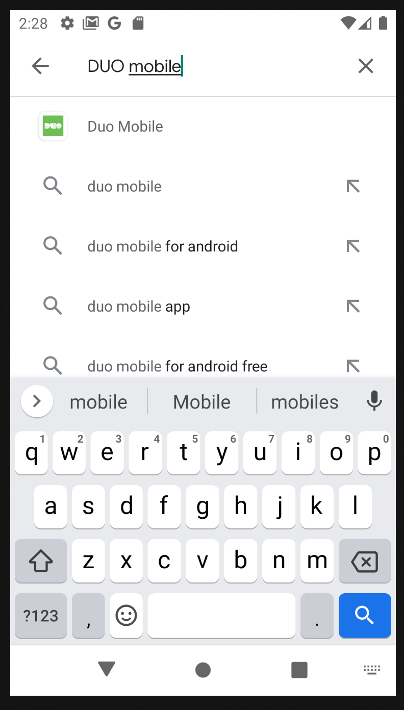
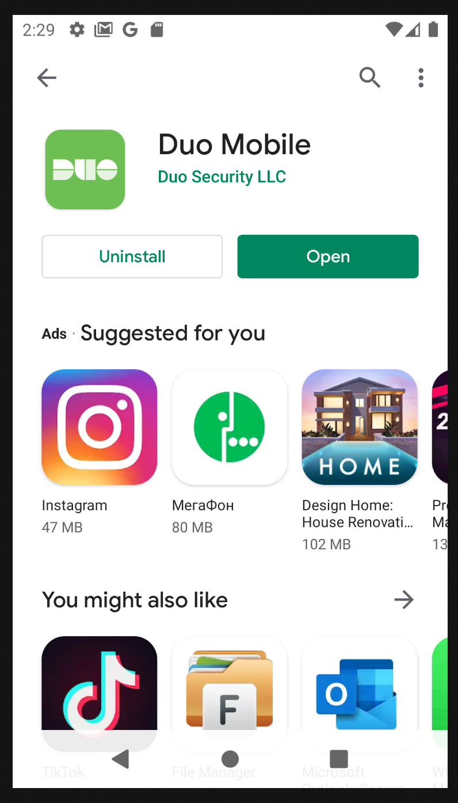
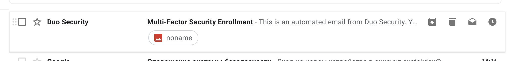
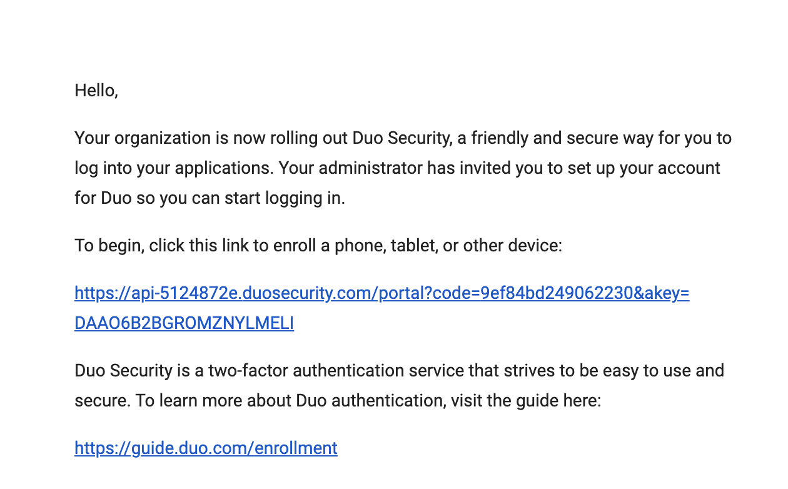
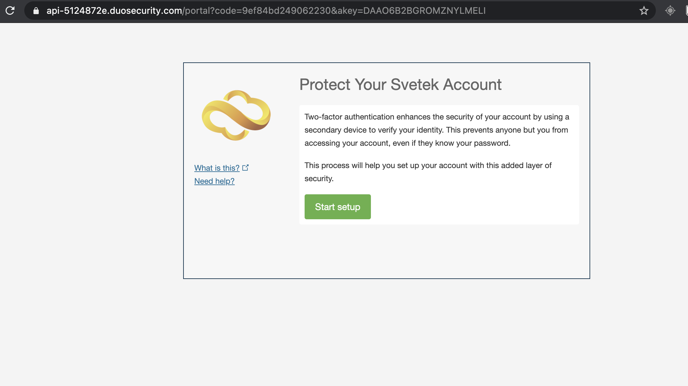
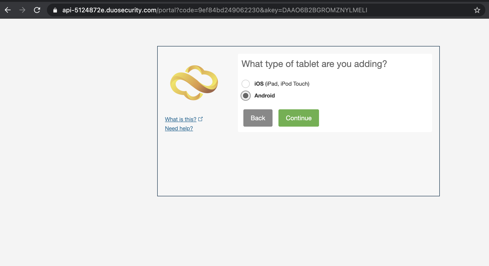
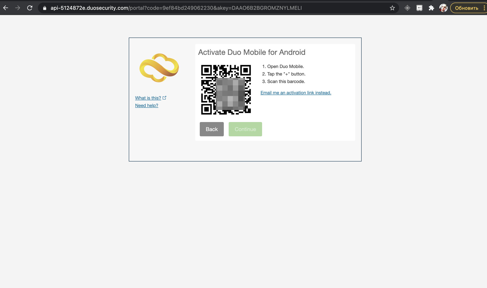

# DUO MFA ENROLLMENT DEVICE 
## INSTALL DUO MOBILE ON YOUR ANDROID DEVICE  
Open Google Play on your Android device, and type DUO mobile.  
You will select DUO Mobile app.     
{:height="600px" width="400px"} 
Press install for start installation process  
{:height="600px" width="400px"}  
When installation is done, press open button for start DUO mobile app.  
{:height="600px" width="400px"}  
For new device you will press "GET Started", If you have account press "Get my account back"  
{:height="600px" width="400px"}  
You will grant permission for take pictures "Only this time"  
{:height="600px" width="400px"}  
Scan QR code when you gо to the previous step  
{:height="600px" width="400px"}  

## GENERATE QR CODE FOR DEVICE
You will recived email from Administrator with URL enrollment link:   
{:height="1024px" width="400px"}  
  
Open URL link and press Start Setup  
  
Select Tabled (iPad, Nexus, etc.) option, for generate QR code.  
  
Select type of enrolment device (Android or iOS).  
  
Press I have DUO mobile installed.  
  
Now you need run DUO mobile and scan QR code for done enrolment device  
  

