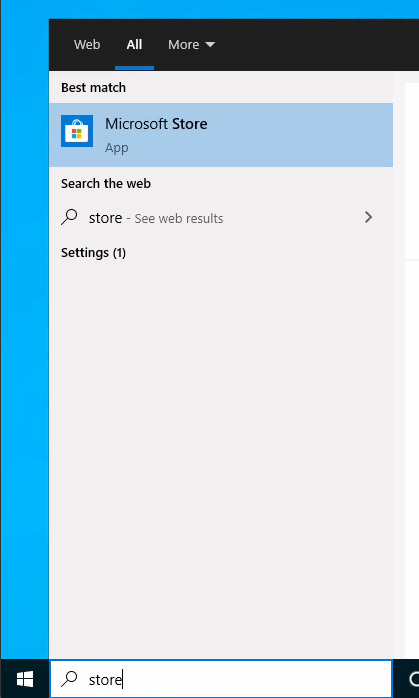
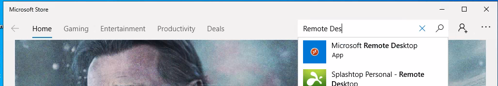
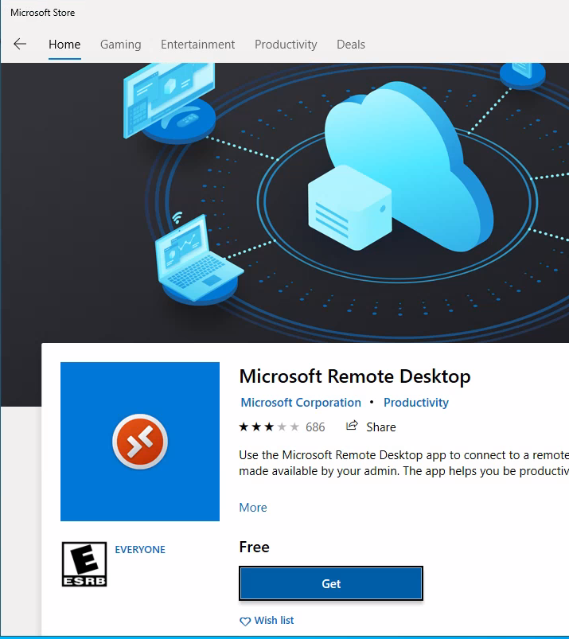
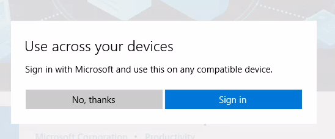
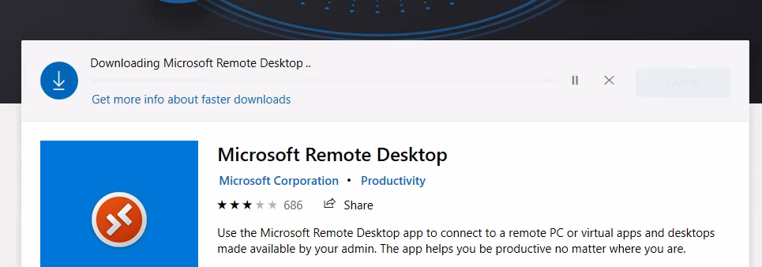
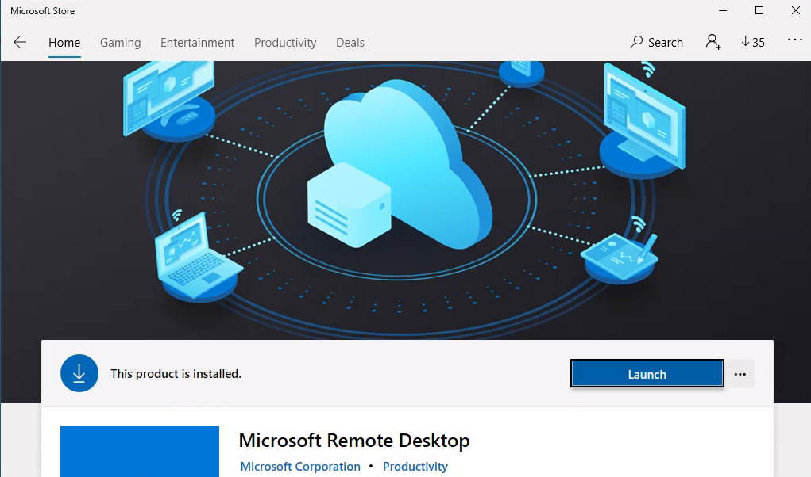
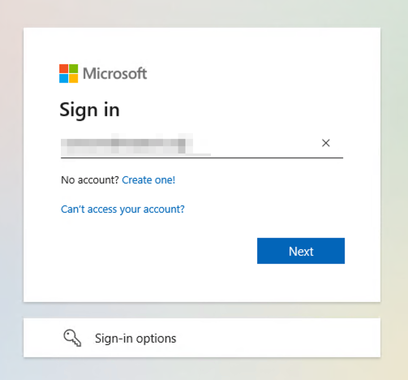
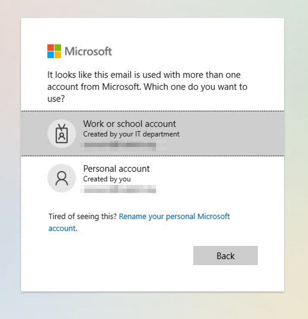
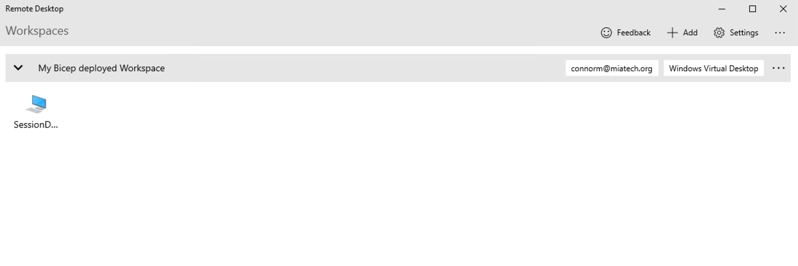

# Install Microsoft Remote Desktop Windows 10
If you use Windows 10 run Microsoft Store just type in search "store" and press on Microsoft Store  
{:height="600px" width="400px"}   
On new windows Microsoft Store in search input type "Remote Desktop" and select "Microsoft Remote Desktop"  
{:height="600px" width="400px"}  
Next step we need press "Get" button for for start downloading app   
{:height="600px" width="400px"}  
On popup window "Use across your devices" press "No, thanks" button  
{:height="600px" width="400px"}  
You will see starting process download and Install app  
{:height="600px" width="400px"}  
When installation process done, you will press "Launch" button  
{:height="600px" width="400px"}  
{:height="600px" width="400px"}  
Now you need add User Workspace. Press "ADD" -> "Workspaces"  
{:height="600px" width="400px"}  
Email or Workspace URL type: https://rdweb.wvd.microsoft.com/api/arm/feeddiscovery  and press "Subscribe button"  
{:height="600px" width="400px"}  
Type your work username / password  
{:height="600px" width="400px"}  
Press "Work or school account"    
{:height="600px" width="400px"}  
Done, now you can try connect to the SessionDesktop or WVD APPs.  
{:height="600px" width="400px"}  

