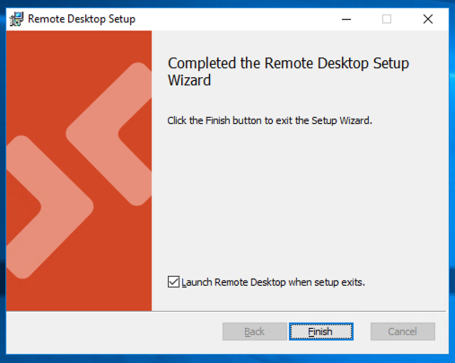
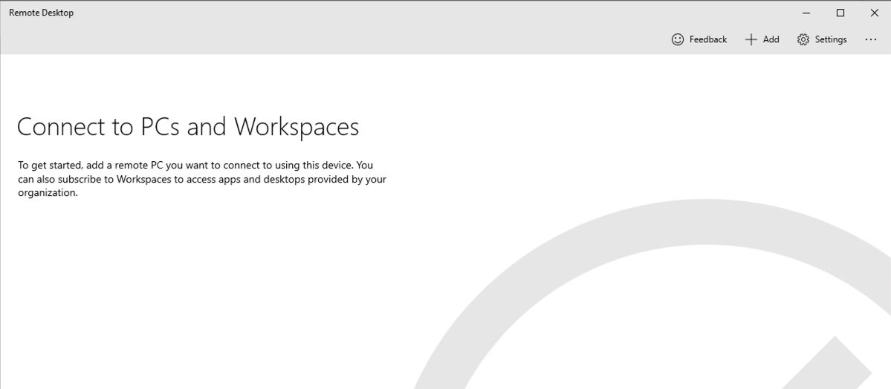
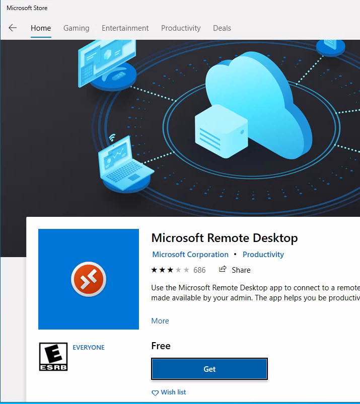
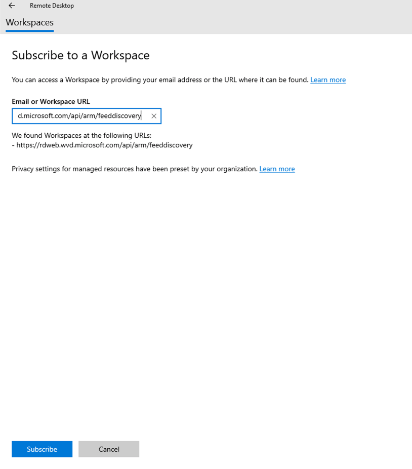
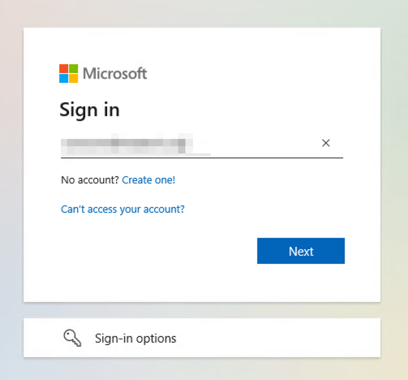
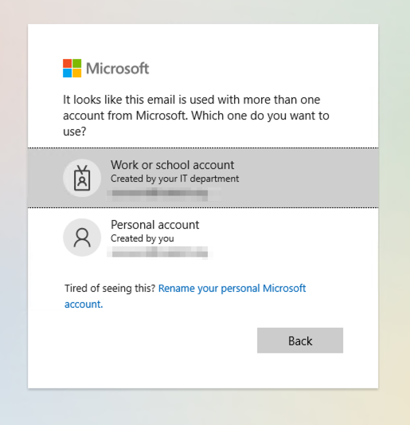

## Table of contents
{: .no_toc .text-delta }

1. TOC
{:toc}

# Install Microsoft Remote Desktop Windows 10 (RDP Client) from msi package (Recommended!!!)
Download MSI on your PC use that URL:   
[Windows 64-bit](https://go.microsoft.com/fwlink/?linkid=2068602)    
[Windows 32-bit](https://go.microsoft.com/fwlink/?linkid=2098960)   
[Windows ARM64](https://go.microsoft.com/fwlink/?linkid=2098961)  
  
When downloading is done, run installation MSI double click on file:   
  
Press RUN button  
  
On Welcome installation windows press Next  
  
Click on checkbox "I accept ...." and press Next  
  
Click on "Install for all users" and press Next  
  
Press Yes  
 
Installation is done. Press Finish for close window and run app.    
  

     
  
Installation is done.  

# Install Microsoft Remote Desktop Windows 10 (RDP Client) from Microsoft store
If you use Windows 10 run Microsoft Store just type in search "store" and press on Microsoft Store  
     
On new windows Microsoft Store in search input type "Remote Desktop" and select "Microsoft Remote Desktop"  
    
Next step we need press "Get" button for for start downloading app   
   
On popup window "Use across your devices" press "No, thanks" button  
  
You will see starting process download and Install app  
  
When installation process done, you will press "Launch" button  
  
     
  
Installation is done.  Go to "ADD WORKSPACE" for configuration Microsoft Remote Desktop.  

# ADD WORKSPACE ACCESS 
Now you need add User Workspace. Press "ADD" -> "Workspaces"  
  
Email or Workspace URL type: https://rdweb.wvd.microsoft.com/api/arm/feeddiscovery  and press "Subscribe button"  
    
Type your work username / password  
   
Press "Work or school account"    
  
Done, now you can try connect to the SessionDesktop or WVD APPs.  
   

# Configure redirection folders  
## OS X  
Open Microsoft Remote Desktop app and got to "Preferences...".  
   

Open DropDown "if folder redirection is enabled for RDP. ..." and select "Choose folder".  
   

Select local folder for redirect to WVD session host.  
   

Try connect and check redirection folder  
   

