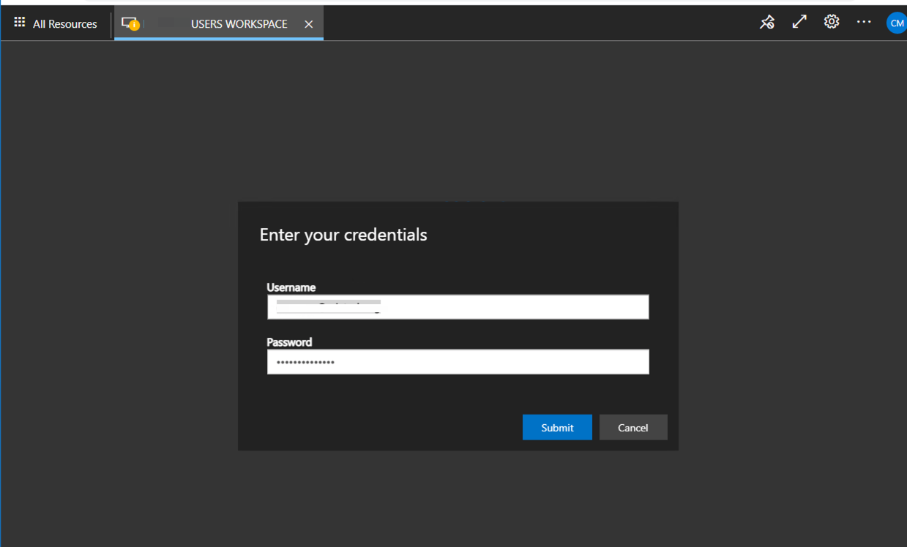
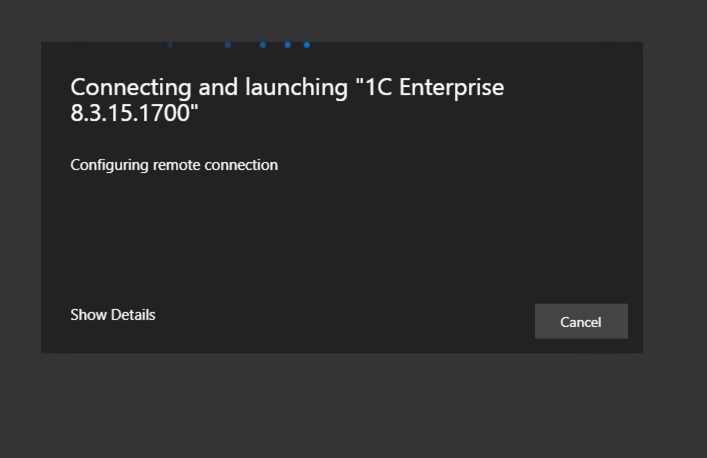

## Table of contents
{: .no_toc .text-delta }

1. TOC
   {:toc}
   
### Azure Virtual Desktop WEB Client 
In a browser, navigate to the Azure Resource Manager-integrated version of the Azure Virtual Desktop web client at https://rdweb.wvd.microsoft.com/arm/webclient and sign in with your user account.  

Enter your work username  
     
  
Enter your password   
  
  
Press yes if you use personal PC  
  
  
You logged in to your workspace, and here you can see remote Apps wich you have access.    
For run remote app just double click on app name.  
  
  
On this step you can allow Clipboard and Printer forward from your PC, press Allow  
  
  
Enter your work username and password and press "Submit"    
  
  
On this step, if your organization use MFA ACCESS, you will recived push notifications on mobile phone for approve login. 
Also you can press Show Details for change MFA settings or select another way to approve your login.  
  
  
If you press "Show Details" on previous step, you can change approve metod here.  
  
  
Your app is run. 
  

